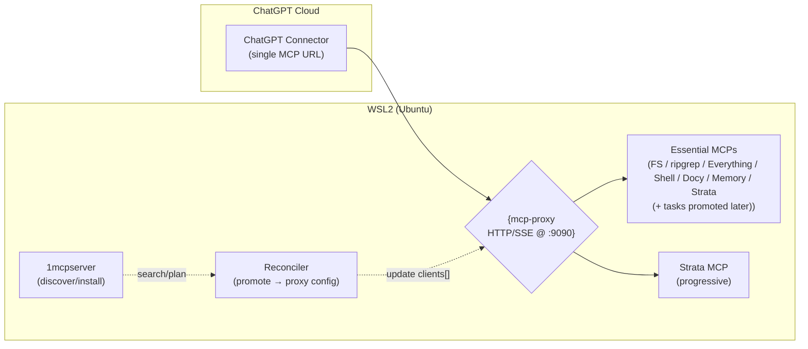

# stelae

**Status:** Final proposal • **Scope:** Local, open‑source, URL‑based MCP stack for agentic dev on the *Phoenix* repo • **Owner:** You • **Audience:** Engineers/Operators

---

## 0. Executive Summary

This document specifies a production‑quality, *WSL‑native* MCP stack that exposes a **single public URL** to ChatGPT via **`mcp-proxy`** (Go), bundles a curated set of **essential tools** (Filesystem/Search/Sandbox/Docs/Tasks/Memory/**Strata**), and uses **`1mcpserver`** as a *sidecar discovery/installer* to promote new MCPs into the catalog on demand. Everything runs locally; no paid services are required.

*Core goals*:

- One URL for ChatGPT; typed, low‑latency tools
- Progressive expansion (avoid tool overload), but keep *everything available* on request
- Agent can promote tools into **`mcp-proxy`** (core) *or* under **Strata** (peripheral) at runtime
- WSL‑native first; Docker only when unavoidable
- Secure by default; auditable; deterministic

*Primary components*:

- Orchestrator: **TBXark/**`mcp-proxy` — single HTTP/SSE endpoint, merges tools/prompts/resources; supports upstream **stdio / SSE / streamable HTTP**
- Progressive discovery: **Klavis Strata** — open‑source MCP that scales beyond 40–50 tools via *discover → details → execute*
- Discovery/Install engine: **particlefuture/**`1mcpserver` — off‑path helper that searches, selects, and outputs config needed to add servers to the proxy
- Essentials (initial): Filesystem, ripgrep/Everything search, **mcp-shell** (command exec) *or* **terminal-controller-mcp**, docs fetch (Docy), sequential thinking, memory (tasks will be promoted later via `1mcpserver` once the stack is stable)

> **Implementation status:** Manual boot confirms `fs/rg/sh/docs/mem/strata` via `mcp-proxy` with direct binaries. PM2 orchestration, per-tool startup banner capture, and the reconciler-driven promotion path (including re‑adding `mcp-tasks`) remain outstanding—see `TODO.md` before treating this as production-ready.

---

## 1. High‑Level Architecture



*Flow*:

1. ChatGPT connects to **`mcp-proxy`** (the *only* URL) → sees a *small, typed* tool surface (essentials + a handful of Strata meta‑tools).
2. When the agent needs something new, it calls a *local* **reconciler** that uses **`1mcpserver`** to find candidates and emits the stanza needed to add that server to **`mcp-proxy`** (or under Strata), then triggers a quick reload/swap.
3. The agent now calls the newly promoted tools as *first‑class typed tools* from the same URL.

---

## 2. Components & References

> All links are to public GitHub or official docs.

- **Orchestrator:** TBXark/**mcp-proxy** — Go proxy that aggregates *tools/prompts/resources* from many MCP servers, serving one HTTP/SSE endpoint. Supports upstream **stdio**, **SSE**, and **streamable HTTP**. Remote config URL supported.
  [mcp-proxy](https://github.com/TBXark/mcp-proxy)

- **Progressive discovery router:** Klavis‑AI/**klavis** (Strata) — open‑source MCP; “intent → details → execute” to avoid tool overload and scale beyond 40–50 tools.
  [klavis](https://github.com/Klavis-AI/klavis)

- **Discovery & install (off‑path):** particlefuture/**1mcpserver** — “MCP of MCPs”; auto‑discovers and outputs config info to add/connect MCP servers locally or remotely.
  [1mcpserver](https://github.com/particlefuture/1mcpserver)

- **Command execution (pick one):**
  • sonirico/**mcp-shell** — shell actuator MCP with allow/deny control; Go backend.
  [mcp-shell](https://github.com/sonirico/mcp-shell)
  • GongRzhe/**terminal-controller-mcp** — secure terminal exec + FS ops; Python backend.
  [terminal-controller-mcp](https://github.com/GongRzhe/terminal-controller-mcp)

- **Filesystem & search:**
  • Filesystem MCP (choose a conservative, path‑scoped server; TS or Rust variants exist)
  • erniebrodeur/**mcp-grep** (ripgrep‑like) — content search in repos.
  [mcp-grep](https://github.com/erniebrodeur/mcp-grep)
  • mamertofabian/**mcp-everything-search** (Windows Everything) — filename search.
  [mcp-everything-search](https://github.com/mamertofabian/mcp-everything-search)

- **Docs fetch:** oborchers/**mcp-server-docy** — fetch/scrape docs to Markdown.
  [mcp-server-docy](https://github.com/oborchers/mcp-server-docy)

- **Reasoning:** modelcontextprotocol/**servers** → `src/sequentialthinking` — “plan/think” tools.
  [sequentialthinking](https://github.com/modelcontextprotocol/servers/tree/main/src/sequentialthinking)

- **Memory:**
  • basicmachines-co/**basic-memory** — markdown/graph memory.
  [basic-memory](https://github.com/basicmachines-co/basic-memory)
  • hungryrobot1/**MCP-PIF** — prompt-indexed files.
  [MCP-PIF](https://github.com/hungryrobot1/MCP-PIF)
- **Queued for promotion (via 1mcpserver once baseline is stable):**
  • flesler/**mcp-tasks** — local tasks list.
  [mcp-tasks](https://github.com/flesler/mcp-tasks)

- **Public URL (for ChatGPT):** Cloudflare Tunnel (free) — `cloudflared tunnel --url http://localhost:9090`
  [trycloudflare](https://developers.cloudflare.com/cloudflare-one/connections/connect-networks/trycloudflare/)

---

## 3. Security & Guardrails (baseline)

- **Least privilege**: Filesystem root path allowlist; deny writes outside repo; `.mcpignore` or equivalent for secrets.
- **Command exec**: allowlist commands; working‑dir scoping; timeouts; non‑root user; optional containerized **code‑sandbox** MCP for untrusted code.
  [code-sandbox-mcp](https://github.com/Automata-Labs-team/code-sandbox-mcp)
- **Auditability**: proxy & servers log all tool calls (timestamped); MCP Inspector optional for live tracing.
- **Approvals**: human‑in‑the‑loop prompts for destructive ops (diff previews; confirm flags) or integrate a HITL MCP if desired.
  [Human-In-the-Loop-MCP-Server](https://github.com/GongRzhe/Human-In-the-Loop-MCP-Server)

---

## 4. Installation — WSL‑native (Docker only if needed)

### 4.1 Prereqs

- Windows 11 + **WSL2** (Ubuntu)
- Latest **Node.js** & **npm**; **Go** (for `mcp-proxy`); **Python 3.11+** (for some MCPs); **uv** or **pipx**; **ripgrep**
- **cloudflared** (for the public URL)

### 4.2 Build & run `mcp-proxy` (native)

```bash
# In WSL2
sudo apt-get update && sudo apt-get install -y golang
mkdir -p ~/apps ~/apps/vendor ~/dev/stelae/config ~/dev/stelae/logs
cd ~/apps && git clone https://github.com/TBXark/mcp-proxy.git
cd mcp-proxy && make build
# Prepare config at ~/dev/stelae/config/proxy.json (see §5)
~/apps/mcp-proxy/build/mcp-proxy --config ~/dev/stelae/config/proxy.json
```

> *Tip:* You can also serve the config from an internal HTTP endpoint (remote config URL) and reload by swapping files (see §7 Blue/Green).

### 4.3 Install essentials (examples)

```bash
# Filesystem (example TS server via npm; replace with your chosen FS server)
npm i -g mcp-filesystem-server

# ripgrep-like search
npm i -g mcp-grep

# Windows Everything search (if you want filename search from Windows side)
# Install Everything on Windows and the MCP in WSL (or Windows) per repo README

# Command executor — pick ONE
# A) mcp-shell (Go binary or Docker; README shows native build)
# B) terminal-controller-mcp (Python)
pipx install terminal-controller-mcp

# Doc fetch (Docy)
npm i -g mcp-server-docy

# Sequential thinking (official)
pipx install mcp-sequentialthinking  # or uvx per README

# Memory
pipx install basic-memory
pipx install mcp-pif
# (Tasks will be promoted later via 1mcpserver; hold off on installation for now)

# Strata (progressive discovery)
pipx install strata-mcp
```

### 4.4 Start a public URL for ChatGPT (free)

```bash
cloudflared tunnel --url http://localhost:9090
# Copy the https URL printed in the console
```

### 4.5 Add the connector in ChatGPT

- ChatGPT → Settings → Connectors → **Add** → paste the **cloudflared URL** for `mcp-proxy`.
- In a new chat, enable that connector.

---

## 5. `mcp-proxy` config (essentials + Strata)

Create `~/dev/stelae/config/proxy.json`:

```json
{
  "server": { "listen": "0.0.0.0:9090", "transport": "http" },
  "clients": [
    {
      "name": "fs",
      "type": "stdio",
      "command": "mcp-filesystem-server",
      "args": ["--root", "~/dev/stelae"],
      "namespace": "fs"
    },
    {
      "name": "rg",
      "type": "stdio",
      "command": "mcp-grep",
      "args": ["--root", "~/dev/stelae"],
      "namespace": "rg"
    },
    {
      "name": "shell",
      "type": "stdio",
      "command": "terminal-controller-mcp",
      "args": ["--workdir", "~/dev/stelae", "--allow", "npm,pytest,make,python,git"],
      "namespace": "sh"
    },
    {
      "name": "docy",
      "type": "stdio",
      "command": "mcp-server-docy",
      "args": [],
      "namespace": "docs"
    },
    {
      "name": "memory",
      "type": "stdio",
      "command": "basic-memory",
      "args": ["--store", "~/dev/stelae/.ai/memory"],
      "namespace": "mem"
    },
    {
      "name": "strata",
      "type": "stdio",
      "command": "strata-mcp",
      "args": [],
      "namespace": "strata"
    }
  ]
}
```

> Tasks MCP intentionally omitted from the baseline config; plan to promote `mcp-tasks` via `1mcpserver` once the reconciler pipeline is operational.

---

## 6. Using the system (from ChatGPT)

### 6.1 Everyday flow

1. **Open a Phoenix chat** in ChatGPT and enable the connector.
2. Ask for a task (e.g., "scan repo for TODOs, propose a refactor plan, run tests").
3. The agent calls **typed tools** (fs/rg/sh/docs/mem/strata) via `mcp-proxy`; additional surfaces such as tasks will be promoted later via `1mcpserver`.
4. For rare or new capabilities, the agent triggers the **Reconciler** (below) to search/install via **1mcpserver**, then promotes the chosen server into **`mcp-proxy`** (core) or **Strata** (peripheral). After promotion, the tool appears as first‑class.

### 6.2 Approvals & safety

- Destructive actions (multi‑file writes, shell exec) must carry a `confirm: true` flag or a text confirmation in the chat. You can enforce this by exposing only `*_confirmed` wrapper tools or by using HITL dialogs.

---

## 7. Promotion workflow (Reconciler)

*Goal:* from the *same chat*, request a new capability → discover a server via **1mcpserver** → **append a `clients[]` entry** in `mcp-proxy` config → reload/swap proxy.

*Design options*:

- **A. Quick reload** — write config JSON and restart `mcp-proxy` (fast; minimal downtime).
- **B. Blue/Green** — run two proxies (`:9090` / `:9191`), update the inactive one, then swap Cloudflare ingress or a local Nginx to flip traffic.

*Client stanza patterns*:

- `type: "stdio"` → `command`, `args[]`
- `type: "sse"` or `"streamable-http"` → `url`

> *Tip:* Keep a local whitelist of *core* vs *peripheral* tags. The Reconciler decides where to promote (directly into `mcp-proxy` for core, or under **Strata** for peripheral).

---

## 8. ADRs (Architectural Decision Records)

**ADR‑1 — Single URL via `mcp-proxy`**
*Decision:* Use TBXark/**mcp-proxy** as the only public MCP endpoint (ChatGPT connector).
*Why:* Low latency, typed schemas, stable merge of tools/prompts/resources; upstream transport flexibility.
*Trade‑offs:* Requires a small reload to add tools unless you implement live promotion.

**ADR‑2 — Progressive discovery via Strata**
*Decision:* Include **Strata** in essentials to expose large surfaces without overload.
*Why:* Scales beyond 40–50 tools; agent can pull details only when needed.
*Trade‑offs:* Adds a discovery interaction step for deep catalogs.

**ADR‑3 — Off‑path discovery/installer is `1mcpserver`**
*Decision:* Use **1mcpserver** to search/select MCPs and output config details for promotion.
*Why:* Minimal footprint; emits actionable config; avoids putting discovery on the hot path.
*Trade‑offs:* Young project; keep a manual fallback (mcp‑mcp) for browsing.

**ADR‑4 — WSL‑native processes**
*Decision:* Prefer native services; Docker only when needed (e.g., sandboxed exec).
*Why:* Less overhead, better filesystem performance, simpler developer ergonomics.
*Trade‑offs:* Some MCPs may publish Docker‑first docs; adapt launch commands.

**ADR‑5 — Command exec MCP choice**
*Decision:* Default to **terminal-controller-mcp** for fine‑grained flags and Python simplicity; expose `mcp-shell` as an alternate profile.
*Why:* Both satisfy allowlist/dir scoping; pick one to keep surface small.

---

## 9) Ops: starting, monitoring, and persistence

You have two good WSL‑friendly options:

### 9.1 **pm2** (recommended for ease)

- Install: `npm i -g pm2`
- Create `ecosystem.config.js` with apps (mcp-proxy, strata, 1mcpserver, key MCPs)
- `pm2 start ecosystem.config.js && pm2 save`
- `pm2 startup systemd` (WSL supports systemd; this auto‑starts PM2 on distro boot)

*Example `ecosystem.config.js`*

[!] - `script: '/home/USER/apps/mcp-proxy/build/mcp-proxy'`  
[!] - `args: '--config /home/USER/dev/stelae/config/proxy.json'`  
[!] - Logs → `~/dev/stelae/logs/*.log`  
[!] - `cwd: '/home/USER/apps/mcp-proxy'`  
[!] - Reconciler runs from `~/dev/stelae/reconciler/reconcile.py`, invoked via `make promote`.

```js
module.exports = {
  apps: [
    { name: 'mcp-proxy', script: './build/mcp-proxy', args: '--config /home/USER/apps/mcp-proxy/config.json' },
    { name: 'strata', script: 'strata-mcp' },
    { name: 'docy', script: 'mcp-server-docy' },
    { name: 'memory', script: 'basic-memory', args: '--store /home/USER/dev/Phoenix/.ai/memory' },
    { name: 'shell', script: 'terminal-controller-mcp', args: '--workdir /home/USER/dev/Phoenix --allow npm,pytest,make,python,git' },
    { name: '1mcp', script: 'python', args: '-m one_mcp_server', cwd: '/home/USER/apps/1mcpserver' }
  ]
}
```

### 9.2 **systemd** (native, most robust)

- Enable systemd in WSL (`/etc/wsl.conf` → `[boot]\nsystemd=true` → `wsl --shutdown`)
- Create unit files in `/etc/systemd/system/` (one per service)
- `systemctl daemon-reload && systemctl enable --now mcp-proxy.service`

*Example `mcp-proxy.service`*

```ini
[Unit]
Description=MCP Proxy
After=network-online.target

[Service]
WorkingDirectory=/home/USER/apps/mcp-proxy
ExecStart=/home/USER/apps/mcp-proxy/build/mcp-proxy --config /home/USER/apps/mcp-proxy/config.json
Restart=on-failure
User=USER

[Install]
WantedBy=multi-user.target
```

> Choose **pm2** for the quickest multi‑process UX; choose **systemd** if you prefer distro‑level lifecycle. You can also *use both*: `pm2 startup` installs a user service under systemd.

---

## 10. Adding new commands/MCPs to *essentials*

[!] - Use `make promote CAPABILITY="…" TARGET=core|strata`.  
[!] - Reconciler edits `proxy.json` under `~/dev/stelae/config/`.

1. Run a *promotion* request in chat ("I need Playwright browser control")
2. Reconciler calls **1mcpserver** search → returns candidates + install/connect details
3. Reconciler appends a `clients[]` stanza to `mcp-proxy` config (stdio or http/sse)
4. Quick‑reload proxy (or blue/green swap)
5. The new tool appears as *typed* under the single URL

*Policy*:

- *Core/essential*: add to **`mcp-proxy`** directly (typed tools visible up front)
- *Peripheral/rare*: add under **Strata** and let the agent expand progressively

---

## 11. Phoenix repo integration

- Set Filesystem/grep working roots to the Phoenix repo path
- Keep knowledge seeds in `./.ai/memory/` (patterns, decisions); task seeds can wait until the dedicated MCP is promoted
- Expose `npm`, `pytest`, `make`, `git` via shell allowlist
- Document any Phoenix‑specific MCPs (e.g., custom build or generators) as promotion candidates

---

## 12. Benefits & Limitations

*Benefits*:

- One URL; typed schemas; fast tool calls
- Progressive discovery without overload (Strata)
- Local, open‑source; no paid services
- Deterministic, auditable; approvals for destructive ops
- Clear promotion path for new capabilities

*Limitations*:

- `mcp-proxy` catalog updates require a quick reload (or blue/green swap) unless you implement live `listChanged`
- Some community MCPs are immature; vet before promotion
- WSL/systemd and Windows/Everything bridging needs care if you mix sides

---

## 13. Maintenance & Evolution

- **Updates**: track upstream repos (proxy, strata, 1mcpserver, essentials)
- **Profiles**: maintain multiple proxy configs (dev/docs/ops) for experimentation
- **Observability**: centralize logs; optionally run MCP Inspector for traces
- **Security reviews**: re‑audit allowlists, FS roots, and any new MCPs quarterly
- **Optional live promotion**: implement MCP `notifications/tools/list_changed` in a controller if clients you use fully support it

---

## 14. Quick Commands (cheat‑sheet)

```bash
# Start proxy manually
~/apps/mcp-proxy/build/mcp-proxy --config ~/dev/stelae/config/proxy.json

# Cloudflared quick tunnel
cloudflared tunnel --url http://localhost:9090

# PM2 workflow
pm2 start ~/dev/stelae/ecosystem.config.js && pm2 save && pm2 startup systemd

# Systemd workflow
sudo systemctl enable --now mcp-proxy.service

# Reconciler (via Makefile)
make promote CAPABILITY="browser automation" TARGET=core
```

---

## 15. Appendix — References

- `mcp-proxy` — [https://github.com/TBXark/mcp-proxy](https://github.com/TBXark/mcp-proxy)
- Klavis Strata — [https://github.com/Klavis-AI/klavis](https://github.com/Klavis-AI/klavis)
- `1mcpserver` — [https://github.com/particlefuture/1mcpserver](https://github.com/particlefuture/1mcpserver)
- `mcp-shell` — [https://github.com/sonirico/mcp-shell](https://github.com/sonirico/mcp-shell)
- `terminal-controller-mcp` — [https://github.com/GongRzhe/terminal-controller-mcp](https://github.com/GongRzhe/terminal-controller-mcp)
- `mcp-grep` — [https://github.com/erniebrodeur/mcp-grep](https://github.com/erniebrodeur/mcp-grep)
- `mcp-everything-search` — [https://github.com/mamertofabian/mcp-everything-search](https://github.com/mamertofabian/mcp-everything-search)
- Docy — [https://github.com/oborchers/mcp-server-docy](https://github.com/oborchers/mcp-server-docy)
- Sequential Thinking — [https://github.com/modelcontextprotocol/servers/tree/main/src/sequentialthinking](https://github.com/modelcontextprotocol/servers/tree/main/src/sequentialthinking)
- basic-memory — [https://github.com/basicmachines-co/basic-memory](https://github.com/basicmachines-co/basic-memory)
- MCP-PIF — [https://github.com/hungryrobot1/MCP-PIF](https://github.com/hungryrobot1/MCP-PIF)
- code-sandbox-mcp — [https://github.com/Automata-Labs-team/code-sandbox-mcp](https://github.com/Automata-Labs-team/code-sandbox-mcp)
- Cloudflared quick tunnels — [https://developers.cloudflare.com/cloudflare-one/connections/connect-networks/trycloudflare/](https://developers.cloudflare.com/cloudflare-one/connections/connect-networks/trycloudflare/)
