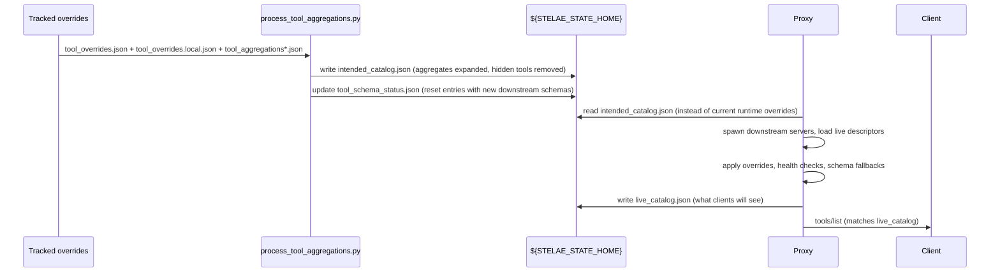
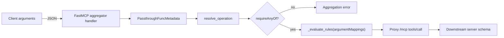
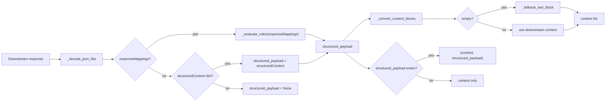

# Intended Catalog & Live Catalog Proposal

## 1. Context

Recent debugging made it clear that we have three distinct “catalog” views:

1. **Tracked overrides** (`config/tool_overrides.json` + the local overlay) – authoritative source of handwritten patches and aggregate descriptors.
2. **Runtime overrides** (`${STELAE_STATE_HOME}/tool_overrides.json`) – currently a near-copy of the tracked overrides with aggregate entries enabled and raw tools disabled.
3. **Proxy catalog** (`/mcp tools/list`) – what Codex / connectors actually see after the Go proxy merges live descriptors, applies health gates, and persists schema fallbacks inside `tool_schema_status.json`.

Because the runtime overrides sit between (2) and (3), we end up debugging multiple layers whenever a schema drifts or an aggregate double-encodes its payload. This doc proposes collapsing the “intended view” into a single synthesized catalog, while keeping the proxy’s runtime merge for health gating and schema fallback.

## 2. Goals

- **Single source of truth for tooling.** Tests, docs, and automation should be able to read one file that reflects what we *expect* the proxy to serve.
- **Runtime introspection.** The proxy should persist the *actual* catalog it advertised after applying runtime decisions (disabled servers, schema downgrades, etc.).
- **Automatic schema adoption.** When downstream servers change their `outputSchema`, aggregates should adopt the new schema automatically (or log deltas) instead of relying on manual edits.
- **Deterministic formatting.** Aggregates keep controlling request/response mapping; FastMCP shims only skip redundant conversions.

## 3. Proposed Artifacts

| Artifact | Location | Purpose |
| --- | --- | --- |
| Tracked overrides | `config/tool_overrides.json` + `${STELAE_CONFIG_HOME}/tool_overrides.local.json` | Hand-authored source of truth for base server descriptors and aggregate entries. |
| **Intended catalog (new)** | `${STELAE_STATE_HOME}/intended_catalog.json` | Fully materialized view produced by `scripts/process_tool_aggregations.py` after it merges tracked overrides, local overlays, and aggregate definitions. Hidden tools are removed. Aggregates can embed downstream schemas when `responseMappings` are absent. |
| Runtime overrides (optional) | `${STELAE_STATE_HOME}/tool_overrides.json` | Could become a synonym for `intended_catalog.json` (or be retired). |
| **Live catalog (new)** | `${STELAE_STATE_HOME}/live_catalog.json` | Snapshot written by the Go proxy after it loads downstream servers, applies overrides, enforces health gates, and captures schema fallbacks. Mirrors the most recent `tools/list` payload. |
| Schema status cache | `${STELAE_STATE_HOME}/tool_schema_status.json` | Append-only log of schema adoption attempts; used to stage new schemas before they are promoted. |

## 4. Flow (Intended → Live)

### Request path

### Response path

## 5. Schema Adoption Strategy

1. **Detect changes** – When process_tool_aggregations sees a different downstream schema (via the tracked overrides or a cached descriptor), reset the relevant entry in `tool_schema_status.json` and mark it as “pending adoption.”
2. **Attempt new schema first** – On the next call, the proxy (or aggregator) uses the new schema. If the downstream response validates, promote it: update the cache and, if the aggregate mirrors the schema, overwrite its `outputSchema` inside `intended_catalog.json`.
3. **Fallback chain** – If validation fails, try the previous override schema, then the generic wrapper. Log the failure and keep the older schema in `intended_catalog.json` until a human intervenes.
4. **Manual overrides** – Aggregates with custom `responseMappings` (or a `lockSchema` flag) skip auto-adoption entirely.

## 6. Pros & Cons

| Aspect | Pros | Cons / mitigations |
| --- | --- | --- |
| Single intended catalog | Tests/docs use one file; easier diffing; hidden tools truly vanish | Need to ensure aggregator mappings embed accurate schemas. Use downstream schema references + auto-adoption to reduce manual edits. |
| Live catalog snapshot | Clear audit trail of what clients saw; can diff against intended view | Adds another file to manage. Mitigation: write on proxy restart only, rotate old copies. |
| Auto schema adoption | Less manual work; fewer stale schemas | Need guardrails for breaking changes. Mitigation: `locked` flag + warnings when diff is significant. |
| FastMCP passthrough | Eliminates double-encoding | None—already in place. |
| Config complexity | Maintains separate tracked overrides for debugging | Extra docs/tests to keep the layering understandable. |

## 7. Pitfalls / Open Questions

1. **Who owns the downstream descriptor cache?** Options: keep it inside process_tool_aggregations (read from local overrides) or let the proxy dump its live descriptors into a file the render step can import. *Lean: proxy exports its merged descriptors so the render step always consumes the same “live” data the catalog actually used.*
   - Action: extend the Go proxy to write every downstream descriptor it loads to `${STELAE_STATE_HOME}/live_descriptors.json`; update `process_tool_aggregations.py` to consume that file when present and fall back to tracked overrides otherwise; add a smoke-test assertion that the snapshot matches `/mcp tools/list`.
2. **Versioning intended vs live catalogs.** Need to decide retention/rotation so we can diff historical snapshots without filling `~/.config/stelae/.state`.
3. **Health gating scenarios.** When a server fails to start, the live catalog will be a subset of the intended view. Automation should treat that diff as a signal to investigate rather than automatically rewriting the intended catalog.
4. **CLI impacts.** Tools like `scripts/stelae_integrator_server.py --cli --operation list_discovered_servers` currently reference tracked overrides. We need to decide whether they switch to reading intended_catalog, live_catalog, or both. *Likely: CLI defaults to intended catalog, with a `--live` flag for runtime diffs.*
   - Action: update the CLI to load `intended_catalog.json` by default, add `--live-catalog` to point at `live_catalog.json`, and document both options in README/docs so operators know which view they are inspecting.
5. **Aggregate schema derivation.** For multi-operation aggregates we may want to embed per-operation downstream schema references to aid diagnostics. That’s an enhancement on top of auto-adoption.
6. **Breaking schema alerts.** Need a policy for “new schema failed validation N times”—log? fail render? notify CI? *Proposal: treat repeated fallbacks as failures in `make verify-clean` so schema drift can’t sneak into PRs.*
   - Action: enhance `process_tool_aggregations.py` (or a companion check) to track schema adoption attempts; after two failed validations, write a “pending schema upgrade” marker and have `make verify-clean` fail until the aggregate or downstream schema is updated; emit actionable logs (tool name, diff summary) to guide fixes.
7. **Migration plan.** Must describe how existing installations transition: ship intended_catalog alongside current overrides, let the proxy read both until the new flow stabilizes, then flip the default. Smoke tests should cover both paths during rollout.
   - Action: Phase 1 – render step writes both legacy runtime overrides and `intended_catalog.json` while the proxy still reads the legacy path. Phase 2 – proxy learns to read intended catalog (flag-gated) and emits `live_catalog.json` while honoring the old file. Phase 3 – flip the default to intended catalog, remove the legacy path from docs after one release, and keep smoke tests exercising both modes during the transition.

## 8. Recommended Next Steps

1. Teach `scripts/process_tool_aggregations.py` to emit `intended_catalog.json` (aggregates expanded, hidden tools dropped) alongside the existing runtime overrides.
2. Update the Go proxy config to load the intended catalog instead of the current runtime overrides file.
3. Extend the proxy to dump `live_catalog.json` after it completes the `tools/list` warm-up.
4. Add validation/CLI helpers that diff intended vs live catalogs.
5. Implement schema adoption workflow (reset cache, try new schema first, fall back on failure).
6. Document the new file layout in README + docs/ARCHITECTURE.md and update smoke tests to assert `intended_catalog.json == live_catalog.json` after clean renders.
