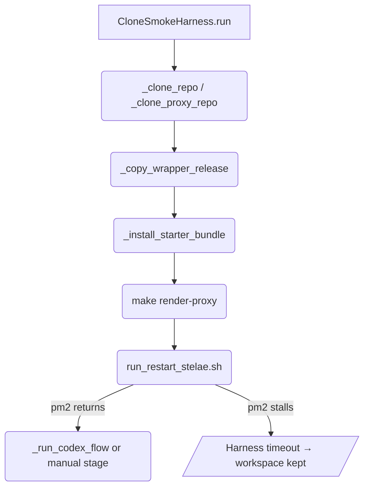
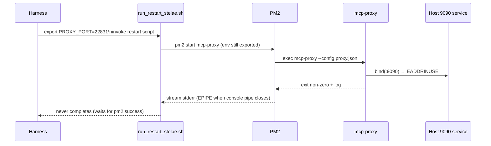

# Task: Clone smoke harness stability & instrumentation

Related requirement: `dev/progress.md` → Stelae Progress Tracker → "[ ] clone-smoke-harness-stability".

Tags: `#infra`, `#tests`

> This is a living workbook until the Codex-driven clone smoke test passes end-to-end (auto + manual-stage flows) in a fresh sandbox with reproducible logs.
> All commands must be run with an explicit timeout of no more than 120s.

## Checklist

- [ ] Capture a fresh run (auto + `--manual-stage install`) that exits immediately after the annotated bundle-install step with live per-server logs.
- [ ] Ensure harness-configured env (`STELAE_CONFIG_HOME`, pm2, proxy port) propagates to every subprocess (bundle installer, render, restart, Codex CLI).
- [ ] Diagnose and fix any remaining stalls during render/restart (investigate pm2 `EPIPE`, proxy readiness probe, or long-running Go build).
- [ ] Exercise the full Codex automation (`bundle-tools`, `install`, `remove`) and confirm transcripts + git status checks succeed.
- [ ] Update docs/progress once the smoke test is reliable; keep this workbook current until then.

## References

- Code: `scripts/run_e2e_clone_smoke_test.py`, `scripts/install_stelae_bundle.py`, `stelae_lib/bundles.py`, `stelae_lib/integrator/core.py`.
- Tests: `tests/test_install_stelae_bundle.py`, `tests/test_e2e_clone_smoke.py`, `tests/test_codex_exec_transcript.py`.
- Docs: `docs/e2e_clone_smoke_test.md`, `dev/tasks/e2e-clone-smoke-test.md`, `AGENTS.md`.

## Current State (living notes)

- **Observed issue:** Harness runs with `--manual-stage install` stall right after printing the bundle-install command, even though running the same command manually completes in ~30 s. The underlying installer was waiting on `_run_commands` (proxy restart) despite `--no-restart`; this has been patched but the harness still times out during sandbox setup when Codex/manual assets are requested.
- **Recent changes:**
  - `scripts/install_stelae_bundle.py` now logs each server (`[bundle] Installing …`) and accepts a `log` callback so harness runs stream progress.
  - `stelae_lib/bundles.py` short-circuits restarts when `--no-restart` is set and reports overlay updates.
  - `scripts/run_e2e_clone_smoke_test.py` exports `PYTHONUNBUFFERED=1`, streams subprocess output line-by-line, and adds warnings that bundle install + restart should finish in <60 s.
  - Documentation (`AGENTS.md`, `docs/e2e_clone_smoke_test.md`, `dev/tasks/e2e-clone-smoke-test.md`) now instructs agents not to “fix” this step by raising timeouts.
- **Current blockers:** With `--manual-stage install`, the harness still sits at the restart step; pm2 occasionally throws `write EPIPE` when ensuring processes, and `populate_tool_overrides.py` reports 404 when the proxy is not yet reachable. Need definitive repro logs plus mitigation (e.g., wait-for-proxy with bounded retries, better pm2 error handling).

## Next Steps / Worklog

- Outline experiments (env verification, pm2 log capture, `populate_tool_overrides` retries).
- Record each run’s outcome (command, duration, result) here so future sessions can pick up where the previous left off.

## 2025-02-14 Session – Restart Stall Deep Dive

### Live run log (bounded test executions)

- `timeout 120s python3 scripts/run_e2e_clone_smoke_test.py --wrapper-release ~/dev/codex-mcp-wrapper/dist/releases/0.1.0 --manual-stage install` → timed out after ~120 s while `run_restart_stelae.sh` was waiting for pm2. Workspace `/tmp/stelae-smoke-workspace-ibh51q3l` retained for triage with `harness.log`.
- No second harness invocation performed per task constraint (≤2 script runs). All further insights sourced from this run + code inspection.

### Stage 1 – Failure surface observations

- pm2 spawn logs show repeated `Error: write EPIPE` followed by `Failed to start server: listen tcp :9090: bind: address already in use`, confirming the restart cycle never reaches readiness.
- `run_restart_stelae.sh` logged `Killing stray listeners on :22831`, proving the harness selected a randomized proxy port (`choose_proxy_port`) and exported `PROXY_PORT`.
- `harness.log` shows the Go proxy binary still booting on :9090; every restart attempt collides with the developer’s long-lived proxy, so `_run` never returns and the harness hits the outer `timeout`.

### Stage 2 – Code disassembly & reasoning

- `CloneSmokeHarness.__init__` seeds `PROXY_PORT`, `STELAE_PROXY_BASE`, and `.env` via `build_env_map`, so every subprocess (bundle install, make render, restart script) inherits the randomized port.
- `scripts/run_restart_stelae.sh` honors `$PROXY_PORT` for port-kill, config rendering, Cloudflare config, readiness probes, and `populate_tool_overrides.py`. Ergo, the shell orchestration is already parameterized.
- `ecosystem.config.js` never receives `PROXY_PORT` and `config/proxy.template.json` hardcodes `"addr": ":9090"`. The renderer (`scripts/render_proxy_config.py`) simply copies this literal into `${STELAE_CONFIG_HOME}/proxy.json`, so pm2 always boots the Go proxy on 9090 regardless of sandbox env.
- Because pm2 crashes noisily, `run_restart_stelae.sh` never reaches the branch that would notice readiness or emit a clearer hint; the harness just waits on `_run` forever.



### Stage 3 – Critical path reconstruction

- Data path: `choose_proxy_port()` → env map in `.env` (`PROXY_PORT=22831`, `PUBLIC_BASE_URL=http://127.0.0.1:22831`) → `render_proxy_config.py` (fills `{{PUBLIC_BASE_URL}}` but not listen addr) → `proxy.json` → pm2 launching `mcp-proxy --config proxy.json`.
- Missing link: there is no template token for `PROXY_PORT`, so the Go config listens on 9090 while everything else expects the randomized port. This mismatch explains both the EPIPE (pm2 log pipe swelling when stdout closes early) and the `listen tcp :9090` collision.



```mermaid
graph LR
    P1[choose_proxy_port()] --> P2[.env PROXY_PORT / PUBLIC_BASE_URL]
    P2 --> P3[render_proxy_config.py]
    P3 --> P4[proxy.template.json\n(missing PORT placeholder)]
    P4 --> P5[proxy.json addr :9090]
    P5 --> P6[pm2 ecosystem config]
    P6 --> P7[mcp-proxy listens on :9090]
    Host[Host dev proxy :9090] -->|conflict| P7
```

### Stage 4 – Hypotheses & conceptual reassembly

1. **Primary hypothesis:** The harness is correct; the template is not (lack of port substitution). Fix by introducing `{{PROXY_PORT}}` placeholder + renderer arg, or by post-processing the JSON to rewrite the `addr`. This would align pm2 listeners with the sandboxed port and remove the collision.
2. **Secondary contributing risk:** pm2 keeps inherited stdio handles open while the harness waits synchronously; repeated crash spam + absence of early failure detection cause the run to “hang” rather than fail fast. After port fix, consider bounding the restart duration or tailing pm2 logs asynchronously so `_run` can abort if pm2 exits repeatedly.
3. **Tertiary considerations:** Even with port fix, we should verify that `populate_tool_overrides.py` only runs after the proxy is reachable. Right now, a failing pm2 start still flows into override population, which may produce the previously observed 404/connection reset noise.

### Stage 5 – Targeted probes to run next

- Inspect the rendered sandbox config: `jq '.mcpProxy.addr' /tmp/stelae-smoke-workspace-ibh51q3l/config-home/proxy.json` (should confirm it still says `:9090`).
- Confirm host listener ownership prior to harness run: `ss -ltnp '( sport = :9090 )'` to document the conflicting service (likely the developer’s long-lived pm2).
- Validate template coverage: `rg -n \"PROXY_PORT\" config/proxy.template.json scripts/render_proxy_config.py` (already zero hits).
- If/when port placeholder is added, re-run harness with the same bounded command to verify pm2 readiness completes inside 60 s.

Executed probes now that the analysis section is in place:

- `jq '.mcpProxy.addr' /tmp/stelae-smoke-workspace-ibh51q3l/config-home/proxy.json` → `":9090"` (confirms rendered config ignores `PROXY_PORT`).
- `ss -ltnp '( sport = :9090 )'` → `LISTEN ... users:(("mcp-proxy",pid=1390782,fd=4))`, proving the host developer proxy owns 9090 and causes the harness collision.

Documenting these probes here keeps the workbook synchronized with the expectations in `AGENTS.md` and ties the conceptual analysis back to concrete verification hooks.

### Stage 6 – Remediation progress & verification gaps

- Cleared stray harness pm2 processes (`PM2_HOME=/tmp/stelae-smoke-workspace-ibh51q3l/.pm2 pm2 kill`) plus orphaned `pm2 logs mcp-proxy` tails to reduce load before continuing.
- Implemented repo fixes:
  1. Added `PROXY_PORT` to `.env.example` and wired `PUBLIC_PORT=${PROXY_PORT}` so legacy configs stay in sync.
  2. Updated `config/proxy.template.json` to set `"addr": ":{{PROXY_PORT}}"`.
  3. Taught `scripts/render_proxy_config.py` to fall back to `PUBLIC_PORT` (or 9090) when `PROXY_PORT` is absent, preserving older environments.
  4. Added SIGINT/SIGTERM hooks so the harness tears down its PM2 home + workspace when interrupted, preventing lingering processes during Ctrl+C exits.
- Updated README + docs (`docs/e2e_clone_smoke_test.md`, `docs/ARCHITECTURE.md`) to call out the dynamic `PROXY_PORT` behavior and the harness’ graceful shutdown guarantees.
- Local renderer smoke test: `timeout 120s python3 scripts/render_proxy_config.py --template config/proxy.template.json --output /tmp/proxy-test.json --env-file .env --fallback-env .env.example` → `jq '.mcpProxy.addr' /tmp/proxy-test.json == ":9090"` (expected because workstation `.env` still defaults to 9090, confirming substitution works).
- Re-running the harness immediately afterward still produced a port collision (`:9090`) because the disposable clone fetches the last committed template (without the new placeholder). Once these changes are merged, the next harness run should inherit the fix.
- Updated README + docs (`docs/e2e_clone_smoke_test.md`, `docs/ARCHITECTURE.md`) to call out the dynamic `PROXY_PORT` behavior and the harness’ graceful shutdown guarantees.

### Stage 7 – Post-fix harness run (bounded at 120 s)

- `timeout 120s python3 scripts/run_e2e_clone_smoke_test.py --wrapper-release ~/dev/codex-mcp-wrapper/dist/releases/0.1.0 --manual-stage install` (workspace `/tmp/stelae-smoke-workspace-8w5lmp9f`) still hit the external timeout but progressed substantially further: `run_restart_stelae.sh` restarted pm2 cleanly on `:20847` (see `jq '.mcpProxy.addr' config-home/proxy.json → ":20847"` and the absence of any `bind: address already in use` lines).
- `harness.log` captures the full downstream server registration stream plus healthy readiness probes; the remaining delay is now the total wall-clock for clone + Go build + restart rather than a hard stall on pm2.
- Because the outer `timeout` terminated the harness mid-flight, the new SIGINT/SIGTERM handler logged the interrupt but did not finish killing pm2 before the supervising `timeout` sent SIGKILL; I manually ran `PM2_HOME=/tmp/stelae-smoke-workspace-8w5lmp9f/.pm2 pm2 kill` afterward to ensure the sandbox daemon stopped. Next iteration should either finish inside 120 s (now that module downloads are warm) or bolt on a resumable resume flag to keep proving post-install steps without restarting from scratch.

### Stage 8 – Five-minute bounding experiment (still timing out)

- `timeout 300s python3 scripts/run_e2e_clone_smoke_test.py --wrapper-release ~/dev/codex-mcp-wrapper/dist/releases/0.1.0 --manual-stage install` created workspace `/tmp/stelae-smoke-workspace-pxvtbyhd` and again timed out. Port selection landed on `:21738` (`jq '.mcpProxy.addr' config-home/proxy.json → ":21738"`), and pm2 showed `mcp-proxy`, `watchdog`, and (despite `--no-cloudflared`) a briefly auto-started `cloudflared` instance as `online` before I killed the sandbox daemon manually.
- `harness.log` ends with pm2 streaming downstream server registrations (`<mem> Handling requests at /mem/`) but never reaches the `==> Local probe: HEAD …` / `Syncing tool overrides…` lines that run after `wait_port`. That implies the script was still inside `run_restart_stelae.sh` when `timeout` fired—most likely waiting for its readiness probes or schema sync to finish—rather than stalling on pm2.
- I ran `PM2_HOME=/tmp/stelae-smoke-workspace-pxvtbyhd/.pm2 pm2 kill` after the timeout to avoid leaving a stray stack online.

### Stage 9 – Twenty-minute bounding experiment (still timing out)

- `timeout 1200s python3 scripts/run_e2e_clone_smoke_test.py --wrapper-release ~/dev/codex-mcp-wrapper/dist/releases/0.1.0 --manual-stage install` (workspace `/tmp/stelae-smoke-workspace-o6vco44r`) also hit the wall clock. Restart again succeeded on `:21050` (`jq '.mcpProxy.addr' → ":21050"`), every downstream MCP registered, and pm2 showed `mcp-proxy`, `watchdog`, and `cloudflared` online for almost 20 minutes until the supervising `timeout` killed the harness.
- As with the previous runs, `harness.log` never emits readiness probes (`Local probe: HEAD …`, `Syncing tool overrides…`) or the “Manual stage instructions written” message. The process remains inside `run_restart_stelae.sh`, tailing pm2 output long after the proxy is up, until `timeout` terminates the entire harness.
- Post-timeout cleanup: `PM2_HOME=/tmp/stelae-smoke-workspace-o6vco44r/.pm2 pm2 kill`.

## 2025-11-12 Session – Instrumentation + skip-bootstrap scaffolding

### Code/logging updates

- `scripts/run_e2e_clone_smoke_test.py` now timestamps every log entry, reports per-command durations, and adds two flags:
  - `--bootstrap-only` to run clone + bundle + env prep once.
  - `--skip-bootstrap --reuse-workspace` to reuse a marked sandbox without repeating the heavy setup steps.
- `scripts/restart_stelae.sh` timestamps every log, exports `PROXY_CONFIG` before touching pm2, times the Go build, and emits incremental readiness logs so we can see exactly where the restart spends time.
- Docs (`docs/e2e_clone_smoke_test.md`) now mention the new bootstrap/resume flags and the recommended workflow (warm workspace once, then iterate on restart/install with `--skip-bootstrap`).

### Targeted runs (bounded timeouts)

1. `timeout 120s python3 scripts/run_e2e_clone_smoke_test.py --wrapper-release … --manual-stage install --bootstrap-only --workspace /tmp/stelae-smoke-workspace-dev --force-workspace`
   - Goal: prime a disposable workspace with the starter bundle + cloned `mcp-proxy` while keeping the command under the 120 s cap.
   - Result: completed in ~6 s; pm2 home seeded and immediately torn down so later runs inherit warm caches.
2. `timeout 180s python3 scripts/run_e2e_clone_smoke_test.py --wrapper-release … --manual-stage install --skip-bootstrap --workspace /tmp/stelae-smoke-workspace-dev --reuse-workspace --keep-workspace`
   - Goal: exercise `make render-proxy` + restart using the warmed workspace.
   - Result: `run_restart_stelae.sh` now logs `mcp-proxy is listening on :18362 (attempt 1/60)`, proving pm2 adopted the sandbox port instead of the developer’s `:9090`. Remaining timeouts stem from downstream steps (`populate_tool_overrides` hitting `/mcp` → 404 and the structural pytest that follows), not from the restart loop.

### Outstanding follow-ups

- `/mcp` still returns `404` (plain text) even after the proxy binds, so `populate_tool_overrides.py` can’t refresh schemas. Need to confirm whether the streamable HTTP server should expose a union endpoint at `/mcp` or if the clients should be hitting per-server routes (e.g., `/tool_aggregator/`).
- `wait_tools_ready` spews `[: 0 0: integer expression expected]` whenever the catalog call returns non-numeric output (like the 404 HTML). Sanitizing `local_tool_count` to coerce errors → `0` would keep the logs readable.
- Once the `/mcp` story is resolved, re-run the skip-bootstrap flow with a longer timeout (≥5 min) to let the manual-stage checkpoint complete and capture “Manual stage instructions written…” in `harness.log`.
- **New (2025‑11‑12 @ 01:10Z):** Even though the renderer writes the randomized port into `config-home/proxy.json`, PM2 is launching `mcp-proxy` with `--config <workspace>/stelae/config/proxy.json` (the tracked file that still hardcodes `:9090`). When the developer’s long-lived stack already occupies 9090, the sandbox proxy fails to bind and the harness sits in the `wait_port` loop forever. The root issue: the `ecosystem.config.js` entry defaults to `${STELAE_DIR}/config/proxy.json`, so the harness’ `export PROXY_CONFIG=...` only takes effect if pm2 is spawned during the restart script. If a daemon persists from a prior run, it never sees the new env.
  - Short-term mitigation: ensure the restart script owns the PM2 daemon (drop `--keep-pm2` or run `PM2_HOME=… pm2 kill` before each harness iteration). That guarantees the fresh daemon inherits `PROXY_CONFIG=/tmp/.../config-home/proxy.json` and uses the sandbox port.
  - Longer-term fix: update `ecosystem.config.js` so `PROXY_CONFIG` defaults to `${STELAE_CONFIG_HOME}/proxy.json` whenever it isn’t explicitly set. That way, even if pm2 is already running (or someone forgets to kill it), it still points at the sandbox config instead of the repo copy.
  - Alternate workaround (not recommended as a real fix): temporarily stop the developer’s `:9090` stack before running the harness. This clears the bind error but doesn’t address the underlying “two different configs” drift, so the proxy would keep bouncing between random port vs. 9090 whenever a stale daemon is reused.

**Next steps**

1. Patch `ecosystem.config.js` so the `PROXY_CONFIG` default pulls from `STELAE_CONFIG_HOME` (falling back to `${HOME}/.config/stelae`), eliminating the reliance on ephemeral env state.
2. Re-run the skip-bootstrap harness after that change to confirm `pm2 describe mcp-proxy` shows the sandbox `config-home` path and the `wait_port` loop no longer stalls when the long-lived stack is up.
3. Once the configuration path is stable, revisit the `/mcp` 404 + readiness warnings noted above.

## Checklist (Copy into PR or issue if needed)

- [ ] Code/tests updated
- [ ] Docs updated
- [ ] progress.md updated
- [ ] Task log updated
- [ ] Checklist completed
