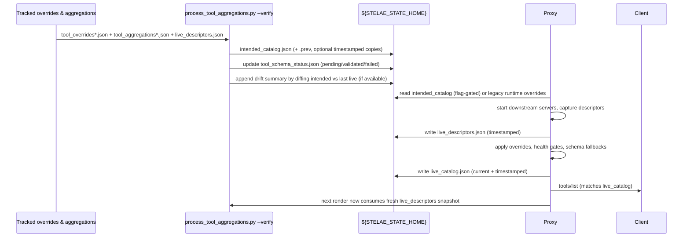

# Intended Catalog & Live Catalog – Enhanced Execution Plan

This document folds the lessons from the assessment set in `dev/notes/assessments/inteded-catalog-plan` back into the original proposal. It keeps the motivating context/goals but adds concrete ownership, instrumentation, and rollout guardrails so the synthesized catalog cannot silently drift.

## 1. Context Recap

Today our "catalog" exists in three forms: tracked overrides, their runtime copy, and whatever the proxy exposes after health gates/schema fallbacks. Debugging schema drift or aggregate bugs means spelunking all three plus PM2 logs. The enhanced plan collapses the intended view into one synthesized catalog, captures the live catalog the proxy actually served, and wires both into tooling/tests so any gap is an explicit signal rather than a mystery.

## 2. Desired Outcomes

- **Deterministic expectations.** Contributors, docs, tests, and CLI helpers consume one intended catalog and know it mirrors the descriptors the proxy most recently loaded.
- **Runtime introspection.** Operators diff the proxy-written live catalog (and raw live descriptors) against intention, getting timestamped drift logs whenever health gates or schema fallbacks fire.
- **Schema auto-adoption with guard rails.** New downstream schemas promote automatically only after successful validation streaks; repeated failures surface in CI/`make verify-clean` before they hit prod clients.
- **Operational hygiene.** Snapshot retention, log rotation, and feature flags prevent `${STELAE_STATE_HOME}` from ballooning while still giving us historical diffs when debugging.
- **Phased migration.** Renderers, CLI/test helpers, and the proxy flip to the new flow behind explicit flags so we can roll forward/back without guesswork.

## 3. Artifacts, Ownership, and Retention

| Artifact | Location | Written By | Primary Readers | Retention / Notes |
| --- | --- | --- | --- | --- |
| Tracked overrides (until config cleanup lands) | `config/tool_overrides.json` | Humans reviewing server descriptors | render scripts, docs | Transitional: remains the editable source until defaults migrate into code per `./intended-catalog-plan-untracked-configs.md`. |
| Local override | `${STELAE_CONFIG_HOME}/tool_overrides.local.json` | Operators | render scripts | Optional overlay; deleting resets to tracked defaults (and will become the primary source once tracked files disappear). |
| Aggregator templates (tracked) | `config/tool_aggregations*.json` | Humans | `process_tool_aggregations.py` | Same transitional note—these disappear once the renderer consumes only config-home/bundle inputs. |
| Config-home & bundle catalogs (post-cleanup) | `${STELAE_CONFIG_HOME}/catalog/*.json` and `${STELAE_CONFIG_HOME}/bundles/*/catalog.json` | Operators/bundle authors | `process_tool_aggregations.py` | Future-state inputs that replace tracked templates; renderer already supports these paths so no behavior change after the migration. |
| **Intended catalog** | `${STELAE_STATE_HOME}/intended_catalog.json` | `scripts/process_tool_aggregations.py` | CLI/tests/docs, proxy (once flipped) | Deterministic render output, hidden tools removed, aggregates expanded. Keep `*.prev.json` copy plus optional timestamped archives when `STELAE_INTENDED_HISTORY=keep`. |
| **Live catalog** | `${STELAE_STATE_HOME}/live_catalog.json` and optional `live_catalog.YYYYmmdd-HHMMSS.json` | Go proxy after warm-up | Operators, diff tooling, tests (`--live`) | Always timestamp writes, keep `current + previous` by default, rotate extra history into `.state/archive/` capped by `STELAE_LIVE_HISTORY_COUNT` (default 5). |
| **Live descriptors (new)** | `${STELAE_STATE_HOME}/live_descriptors.json` (+ timestamped archive) | Proxy whenever it loads/refreshes downstream servers | `process_tool_aggregations.py` (preferred input), diagnostics | Snapshot includes downstream schema hash and health state; render step refuses to run if snapshot missing or stale unless `--allow-stale-descriptors` is passed. |
| Schema status cache | `${STELAE_STATE_HOME}/tool_schema_status.json` | Render + proxy adoption hooks | CLI/tests | Stores per-tool state (`pending`, `validated`, `failed`), attempt counters, last schema hash. Pruned when a schema has been stable for N renders (default 10). |
| Discovery cache (runtime) | `${STELAE_STATE_HOME}/discovered_servers.json` | 1mcp agent / `manage_stelae discover_servers` | Integrator, operators | Fresh clones intentionally start empty; deleting the file resets discovery without touching git. |
| Drift log | `${STELAE_STATE_HOME}/live_catalog_drift.log` | Diff tool invoked during render/restart | Operators/CI | Appends timestamp + summary whenever intended≠live. Rotated with catalog snapshots. |

> **Note:** Sections referencing tracked overrides/aggregations describe the current state. The `./intended-catalog-plan-untracked-configs.md` effort migrates those defaults into code and relies solely on config-home/bundle catalogs; once that lands, update this table to remove the “tracked” rows and treat the config-home entries as the only editable source.

## 4. Which File To Use When

| Question | File | Notes |
| --- | --- | --- |
| "What *should* Codex see after the next render?" | `intended_catalog.json` | Source for docs/tests/smoke harness. |
| "What did the proxy advertise last restart?" | `live_catalog.json` | Mirrors `/mcp tools/list`; includes timestamps + schema delta summary. |
| "What raw descriptors did the proxy load from downstream servers?" | `live_descriptors.json` | Input for next render; proves render step used real descriptors, not stale tracked overrides. |
| "Why is a tool missing?" | `live_catalog_drift.log` | Contains per-tool reasons (health gate, discovery failure, schema fallback). |

## 5. Flow Overview (Intended → Live → Feedback)

## 6. Responsibilities & Guard Rails

### 6.1 Render step (`process_tool_aggregations.py --verify`)

1. Load tracked overrides + overlays.
2. Prefer `live_descriptors.json` for downstream schema data. Refuse to continue if missing/stale unless `--allow-stale-descriptors` or `STELAE_ALLOW_STALE_DESCRIPTORS=1` is set (bootstrap path).
3. Expand aggregates, embed `downstreamSchemaRef` metadata (`toolId`, `operation`, schema hash) whenever `responseMappings` is absent.
4. Emit `intended_catalog.json` plus a `.prev` copy and optional timestamped archive.
5. Update `tool_schema_status.json`:
   - `pending`: downstream schema hash changed since last render.
   - `validated`: N (default 2) consecutive successful validations.
   - `failed`: fallback engaged N (default 2) times; include error snippets + last schema diff.
6. Run `--verify` mode to ensure: no hidden tools leak, aggregator mappings compile, and `intended_catalog` references only descriptors found in live snapshot.
7. Diff intended vs latest live catalog; write human-readable summary (missing tools, schema fallbacks, locked schemas) into `live_catalog_drift.log` and echo to stdout to keep CI loud.

### 6.2 Proxy warm-up

1. On boot/restart read intended catalog (when `STELAE_USE_INTENDED_CATALOG=1`; else legacy runtime overrides).
2. As downstream servers register, dump their descriptors and health state into `live_descriptors.json` + timestamped copy.
3. After applying overrides/health gates/schema fallbacks, write:
   - `live_catalog.json` (symlink or copy for `current`).
   - `live_catalog.YYYYmmdd-HHMMSS.json` (rotated per retention settings).
4. Emit structured logs summarizing: hidden tools, downgraded schemas, adoption attempts, and CLI-friendly diff hints.
5. Expose `/mcp diagnostics/catalog` endpoint (future) returning the same summary to limit log spelunking.

### 6.3 Feedback loop

- Render uses `live_descriptors` by default and optionally `live_catalog` to precompute diffs.
- Smoke tests/`make verify-clean` assert `intended_catalog.json` == `live_catalog.json` after a clean restart (allowing opt-out for known-degraded scenarios via `STELAE_ALLOW_LIVE_DRIFT=1`).

## 7. Schema Adoption & Instrumentation

1. **Detection:** Render stage compares downstream schema hash vs last known; toggles status to `pending` and resets success counter.
2. **Attempt:** Proxy prioritizes the new schema on call. Validation success increments counter; once it reaches `SCHEMA_SUCCESS_THRESHOLD` (default 2), render promotes the schema into `intended_catalog` + marks status `validated`.
3. **Fallback:** Validation failure increments failure counter, logs diff snippet, and flips status `failed`. Proxy sequentially tries prior override schema then generic wrapper.
4. **Escalation:** When failure counter ≥ `SCHEMA_FAILURE_THRESHOLD` (default 2), `make verify-clean` and smoke tests fail with actionable messaging (tool name, hash, diff summary, last error). CLI `stelae catalog status --pending-only` surfaces the same info.
5. **Locks:** Aggregates with `lockSchema: true` bypass auto-adoption entirely; CLI shows them separately so humans know manual action is required.
6. **Telemetry:** Each adoption attempt emits a structured log (`tool`, `schema_hash`, `state`, `duration_ms`, `result`). Optional metrics feed watchers.

## 8. CLI, Testing, and Diff Tooling

- **CLI defaults:** `python scripts/discover_servers_cli.py` and related helpers now read `intended_catalog.json` by default. New flags:
  - `--live-catalog` to read runtime view.
  - `--diff-catalogs` to emit per-tool differences (missing, schema fallback, locked, hidden).
- **Shared helper:** add `scripts/catalog_io.py` exposing `load_intended()`, `load_live()`, `diff_catalogs()` so CLI/tests stay in sync.
- **Pytest:**
  - Fixtures load intended catalog for deterministic assertions.
  - Integration tests add `assert_catalogs_match()` that fails with diff summary if live != intended post-render.
  - Schema adoption tests simulate `pending → validated → failed` paths using fakes for downstream descriptors.
- **Smoke harness:** `python scripts/run_e2e_clone_smoke_test.py` gets two new stages: validate intended catalog render + confirm live catalog parity after restart. Harness stores diffs under `<workspace>/catalog-diffs` for quick inspection.
- **Diff helper:** create `scripts/diff_catalog_snapshots.py <fileA> <fileB>` to pretty-print per-tool changes, reused by CLI/tests/CI.

## 9. Retention & Rotation Policies

| Artifact | Default retention | Overrides |
| --- | --- | --- |
| live_catalog snapshots | keep `current`, `.prev`, plus latest `STELAE_LIVE_HISTORY_COUNT` timestamped copies (default 5) | Set `STELAE_LIVE_HISTORY_COUNT=0` to disable history; set to higher for CI. |
| live_descriptors snapshots | keep `current` + last 3 timestamped copies | Controlled via `STELAE_DESCRIPTOR_HISTORY_COUNT`. |
| intended_catalog archives | disabled by default; enable with `STELAE_INTENDED_HISTORY=keep` to store timestamped copies alongside `.prev`. |
| drift log | rotated with catalog snapshots; `live_catalog_drift.log` trimmed to last 200 entries unless `STELAE_DRIFT_LOG_MAX` overrides. |
| tool_schema_status | compact entries whose statuses have been `validated` for ≥10 renders; archived copies stored under `.state/schema-status/` when `STELAE_SCHEMA_STATUS_ARCHIVE=1`. |

Retention helpers run as part of `make render-proxy` and `scripts/run_restart_stelae.sh` so CI and local dev stay consistent.

## 10. Migration Plan & Feature Flags

| Phase | Flags / Defaults | Actions | Exit Criteria | Rollback |
| --- | --- | --- | --- | --- |
| 0 – Prep | `STELAE_EMIT_LIVE_CATALOG=0`, `STELAE_USE_INTENDED_CATALOG=0` | Land render enhancements, add CLI/test helpers, proxy learns to emit live catalog/descriptors behind disabled flags. | Unit/pytest coverage for new helpers, smoke harness aware of both files. | Disable new flags (already off). |
| 1 – Dual write | `STELAE_EMIT_LIVE_CATALOG=1`, `STELAE_USE_INTENDED_CATALOG=0` | Proxy writes live catalog/descriptors; render consumes descriptors when present; smoke harness diffing intended vs live but proxy still reads legacy overrides. | Two consecutive green smoke runs with zero drift; docs updated with new artifacts. | Toggle flag off, fall back to legacy runtime overrides only. |
| 2 – Flagged read | `STELAE_USE_INTENDED_CATALOG=1` enabled only in CI/canary | Proxy optionally reads intended catalog (fallback to legacy). Continue dual writes. | 100% of CI + at least one PM2 environment running with flag on for ≥48h without drift except expected outages. | Turn flag off. |
| 3 – Default flip | `STELAE_USE_INTENDED_CATALOG=1` default, legacy runtime overrides marked deprecated | Remove legacy path references from docs/tests; keep feature flag for rollback window. | Verified zero drift in smoke + production for one release. | Flip flag off and redeploy older binary if needed. |
| 4 – Cleanup | Remove legacy runtime overrides path after two stable releases | Delete code/docs referencing runtime overrides. | `make verify-clean` + tests no longer touch legacy file. | Reintroduce from git history (last resort). |

## 11. Immediate Work Items

1. **Config cleanup prerequisite** – execute `./intended-catalog-plan-untracked-configs.md` (move tracked defaults into code, rely on config-home/bundle catalogs, relocate discovery cache) so the renderer/proxy paths described above have a single editable source.
2. **Renderer updates** – extend `process_tool_aggregations.py` with `--verify`, descriptor ingestion, drift logging, schema status states, and `downstreamSchemaRef` metadata.
3. **Proxy enhancements** – emit live descriptors + catalog snapshots with rotation, include adoption telemetry, optionally expose `/diagnostics/catalog` endpoint, respect `STELAE_USE_INTENDED_CATALOG`.
4. **CLI/test refactor** – centralize catalog IO helper, add `--live/--diff` flags, and update pytest fixtures + smoke harness to assert parity.
5. **Diff helper + retention scripts** – implement `scripts/diff_catalog_snapshots.py` + rotation utilities invoked from `make render-proxy` and restart scripts.
6. **Docs** – update README, docs/ARCHITECTURE.md, and AGENTS instructions with the "Which file to use when" table, feature flags, and migration chronology.
7. **Telemetry hooks** – wire adoption counters into logs/metrics, ensure `make verify-clean`/CI fail loudly on schema adoption failures or persistent drift.

With these guard rails, `intended_catalog.json` becomes the true synthesis of tracked config + real descriptors, while `live_catalog.json` plus its diffs provide the operational feedback loop needed to keep automation trustworthy.
