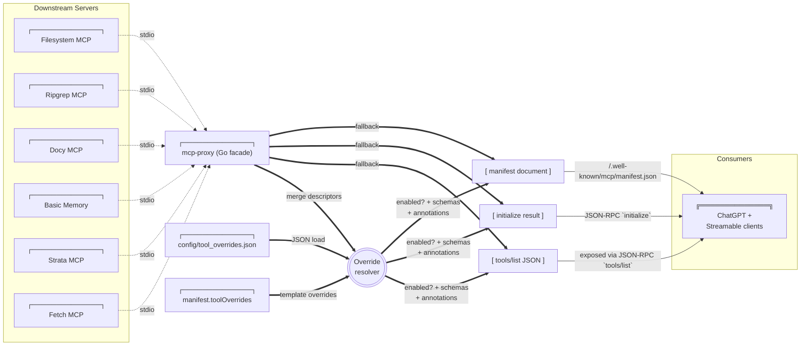
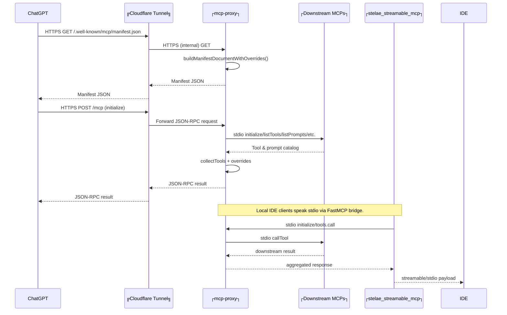

# Stelae MCP Architecture

## Overview

Stelae combines a Go-based MCP aggregation proxy, a fleet of downstream MCP servers, a FastMCP bridge for stdio clients, and a Cloudflare tunnel for public access. Everything originates from the local WSL workspace while remaining consumable by remote ChatGPT Connectors. The Go proxy currently comes from the [`Dub1n/mcp-proxy`](https://github.com/Dub1n/mcp-proxy) fork so we can expose a unified `/mcp` facade (HEAD/GET/POST) for readiness probes and streamable clients while upstreaming the feature.

### Config overlays

Templates live under `config/` in this repo; all machine-specific state is written to `${STELAE_CONFIG_HOME}` (default `~/.config/stelae`). Each template gains a `*.local.*` companion file the first time you edit it via `manage_stelae`/renderers. Runtime artifacts such as `${PROXY_CONFIG}`, `${TOOL_OVERRIDES_PATH}`, and `${TOOL_SCHEMA_STATUS_PATH}` are emitted into `${STELAE_STATE_HOME}` (defaults to `${STELAE_CONFIG_HOME}/.state`), while overlays (`*.local.json`, discovery caches, `.env.local`) stay alongside the config home. Route any future generated files into `.state` to keep the overlay directory human-editable. Deleting the corresponding `.local` file is enough to reset a config back to the tracked default. Environment values obey the same layering: `.env.example` stays generic, `.env` is human-edited, and `${STELAE_CONFIG_HOME}/.env.local` (or the last env file provided to the integrator) receives hydrated defaults so git remains clean even when overrides introduce new variables.

Hygiene guardrail: `pytest tests/test_repo_sanitized.py` fails if tracked templates reintroduce absolute `/home/...` paths or if `.env.example` stops pointing runtime outputs at `${STELAE_CONFIG_HOME}`. Run it after touching configs to ensure `make render-proxy` followed by normal stack usage leaves `git status` clean.

`make verify-clean` wraps the same automation path contributors run manually: it snapshots `git status`, executes `make render-proxy` plus `scripts/run_restart_stelae.sh --keep-pm2 --no-bridge --no-cloudflared --skip-populate-overrides`, and then asserts the working tree matches the pre-run snapshot. Any tracked drift now fails the check immediately.

**Overlay workflow:** after editing tracked templates run `python scripts/process_tool_aggregations.py --scope default`, then `python scripts/process_tool_aggregations.py --scope local`, followed by `make render-proxy` and `pytest tests/test_repo_sanitized.py`. This guarantees `${STELAE_CONFIG_HOME}` (human-edited overlays) and `${STELAE_STATE_HOME}` (generated artifacts) stay in sync. Run `make verify-clean` before publishing manifest changes so restart automation proves `git status` remains empty. The consolidated workbook in `dev/tasks/stelae-smoke-readiness.md` references this loop whenever catalog or harness work begins.

### Core vs optional bundle

- **Tracked core:** custom tools, the Stelae integrator, the tool aggregator helper, the 1mcp stdio agent, and the public 1mcp catalog bridge (plus the Go proxy and FastMCP bridge). These five servers ship in `config/proxy.template.json` so every clone can immediately discover and manage downstream MCP servers, and the only aggregate that ships in git is the in-repo `manage_docy_sources` wrapper for `scripts/docy_manager_server.py`.
- **Starter bundle:** Docy + Docy manager, Basic Memory, Strata, Fetch, Scrapling, Cloudflared/worker helpers, filesystem/ripgrep/terminal controllers, and any other discovery-fed servers defined in `config/bundles/starter_bundle.json`. Install them (along with their overrides/aggregations) via `python scripts/install_stelae_bundle.py` so they only touch `${STELAE_CONFIG_HOME}/*.local.json`; this is the step that populates `workspace_fs_*`, `workspace_shell_control`, `memory_suite`, `doc_fetch_suite`, `scrapling_fetch_suite`, and `strata_ops_suite` in the local aggregator overlay. The Codex MCP wrapper intentionally lives outside this bundle to keep the default manifest lean—install it manually with `manage_stelae install_server` after you copy a wrapper release into `${STELAE_CONFIG_HOME}`.
- Optional modules keep their writable state (`config/*.local.json`, `.env.local`, discovery caches) under `${STELAE_CONFIG_HOME}`. Delete a `.local` file or rerun the installer to move between the slim core and the starter bundle without mutating tracked templates.

### Legend

```text
┌──────────────┐  System / long-lived process
╔══════════════╗  External service (Cloudflare, ChatGPT, etc.)
(  Rounded box )  Ephemeral request/response payload or intermediate document
-->             HTTP(S) / SSE request (labelled as needed)
-.->            stdio / local IPC (labelled "stdio")
==>             Internal data merge / transformation
```

## Catalog Aggregation & Overrides



- Downstream MCP servers register their tool descriptors during startup (`collectTools`).
- Overrides are merged in the following order:
  1. `manifest.toolOverrides` from the rendered proxy config (`${PROXY_CONFIG}`, defaults to `${STELAE_CONFIG_HOME}/proxy.json`).
  2. The overrides template (`config/tool_overrides.json`, validated via `config/tool_overrides.schema.json`) + your `${STELAE_CONFIG_HOME}/tool_overrides.local.json`. Each tool override lives under its server while the `master.tools["*"]` wildcard provides shared defaults, and the merged runtime file at `${TOOL_OVERRIDES_PATH}` is what the proxy consumes.
  3. Master (`*`) overrides apply last.
- Overrides can rewrite names, descriptions, annotations, and full `inputSchema`/`outputSchema` blocks. We use this to advertise the adapted contract the proxy enforces at call time.
- Scrapling’s `s_fetch_page` and `s_fetch_pattern` entries in the overrides template feed the runtime file `${TOOL_OVERRIDES_PATH}`. The call-path adapter in the Go proxy writes back to the runtime file whenever it has to downgrade/upgrade a schema; rerun `make render-proxy` + the restart script after editing those overrides so manifests and streamable clients see the update immediately.
- The proxy filters out any tool/server marked `enabled: false` before producing `initialize`, `tools/list`, and manifest payloads.
- Every `tools/list` descriptor carries `"x-stelae": {"servers": [...], "primaryServer": "..."}` metadata. The restart script + populate helper rely on this to map schemas back to the correct server even after the proxy deduplicates tool names.
- Declarative aggregations are described in `config/tool_aggregations.json`, but the tracked template now holds only the suites that wrap in-repo servers (currently just `manage_docy_sources`). `${STELAE_CONFIG_HOME}/tool_aggregations.local.json` is where the starter bundle installer and any custom additions land, keeping optional third-party tools out of git. `scripts/process_tool_aggregations.py --scope local` validates just that local layer, writes the resulting descriptors to `${TOOL_OVERRIDES_PATH}`, and flips any `hideTools` entries to `enabled: false`. When the default definitions change, run `scripts/process_tool_aggregations.py --scope default` before committing so the tracked overrides stay in sync. `scripts/tool_aggregator_server.py` loads the merged config at runtime so wrappers such as `manage_docy_sources` show up once in manifests even though they fan out to underlying servers.

## Operations & Troubleshooting

### Troubleshooting quick reference

| Symptom | Likely cause | How to fix |
| --- | --- | --- |
| `mcp-proxy` not listening on `:${PROXY_PORT}` | Go build failed or pm2 stopped | `./scripts/run_restart_stelae.sh` or `source ~/.nvm/nvm.sh && pm2 restart mcp-proxy` |
| Override hints missing from manifest | runtime overrides not loaded or stale | confirm `${TOOL_OVERRIDES_PATH}` is valid JSON, rerun `make render-proxy`, then `scripts/run_restart_stelae.sh --full` |
| `tools/call search` returns `{ "results": [] }` | running an old version; static hits missing | rebuild Go proxy (`facade_search.go`) and restart |
| Codex CLI reports “MCP client … request timed out” | STDIO bridge launched without proper env | ensure the Codex config exports `PYTHONPATH=/home/gabri/dev/stelae` and `STELAE_STREAMABLE_TRANSPORT=stdio`; run `make check-connector` locally |
| Cloudflare 530 splash | tunnel momentarily unhealthy | rerun `scripts/run_restart_stelae.sh --full` (validates tunnel + pm2), or `source ~/.nvm/nvm.sh && pm2 restart cloudflared` |
| `make check-connector` flags unexpected catalog | new upstream tools exposed or overrides missing | inspect `logs/mcp-proxy.err.log`, confirm `${TOOL_OVERRIDES_PATH}` is current, rerun restart |
| Startup logs mention "master override" warnings | master-level description/title overrides present | keep only the wildcard `"*"` entry under `master.tools`; move other overrides under their server |
| `tools/call fetch` returns network errors | upstream site blocked / fetch server delay | retry or inspect `logs/fetch.err.log` |
| SSE drops quickly | Cloudflare idle timeout | ensure Go proxy heartbeat loop is running (keepalives every 15s) |

### Reference commands

```bash
# PM2 management
source ~/.nvm/nvm.sh
pm2 status
pm2 logs mcp-proxy --lines 150
pm2 restart cloudflared

# Re-run public probe & archive log
CONNECTOR_BASE=https://mcp.infotopology.xyz/mcp make check-connector

# Manual STDIO smoke test (inside WSL)
python - <<'PY'
import os, anyio
from mcp.client.stdio import stdio_client, StdioServerParameters
from mcp.client.session import ClientSession

params = StdioServerParameters(
    command='/home/gabri/.venvs/stelae-bridge/bin/python',
    args=['-m', 'scripts.stelae_streamable_mcp'],
    env={
        'PYTHONPATH': '/home/gabri/dev/stelae',
        'STELAE_PROXY_BASE': f'http://127.0.0.1:{os.environ.get("PROXY_PORT", "9090")}',
        'STELAE_STREAMABLE_TRANSPORT': 'stdio',
        'PATH': os.environ['PATH'],
    },
    cwd='/home/gabri/dev/stelae',
)

async def main():
    async with stdio_client(params) as (read, write):
        async with ClientSession(read, write) as session:
            init = await session.initialize()
            print(init.serverInfo)
            tools = await session.list_tools()
            print([t.name for t in tools.tools])

anyio.run(main)
PY
```

### Clone smoke harness

- `scripts/run_e2e_clone_smoke_test.py` now provisions a throwaway workspace, installs the full starter bundle, seeds a Codex-friendly "client" repo, mirrors `~/.codex` into an isolated `CODEX_HOME`, drives `codex exec --json` through bundle/install/remove stages, and deletes any previously kept smoke sandboxes (`stelae-smoke-workspace-*` + `.stelae_smoke_workspace`) before creating a new one (unless `--reuse-workspace` is set). The script parses the JSONL transcripts and fails if required MCP calls (`workspace_fs_read`, `grep`, `doc_fetch_suite`, `manage_stelae`) are missing.
- Automatic runs cover the entire regression suite (`pytest tests/test_repo_sanitized.py` early, then the full suite + `make verify-clean` after Codex) and assert `git status` is clean after every managed install/remove. Use `--codex-cli`, `--codex-home`, `--workspace`, or `--wrapper-release` to tweak the sandbox inputs. Raw transcripts live under `${WORKSPACE}/codex-transcripts` for auditing.
- Pass `--manual` to drop back to the human-in-the-loop flow (the harness emits `manual_playbook.md` + `manual_result.json` and exits so a tester can run the mission in `dev/tasks/missions/e2e_clone_smoke.json`). Use `--manual-stage bundle-tools|install|remove` for stage-specific pause/resume, `--reuse-workspace` when resuming an existing sandbox, and `--cleanup-only [--workspace /path]` to retroactively delete kept workspaces without provisioning a new sandbox.
- **Testing rule of thumb:** keep the entire pytest/make suite clone-friendly. Any test that only works in the primary dev workspace must be clearly marked (e.g., pytest marker, separate make target) with rationale, and should never block the clone-focused harness. Default assumption: fresh clones run every regression test without modification.

### Tool aggregation helper

**Why:** Operators wanted a way to expose curated, high-level tools without duplicating logic across MCP servers or manually editing the overrides template. The aggregation helper keeps the catalog clean by letting us describe composites in JSON, hide the noisy downstream entries, and reuse the existing proxy infrastructure for dispatch.

**How it works:**

1. `config/tool_aggregations.json` declares each aggregate tool (manifest metadata, per-operation mappings, validation hints, and a `hideTools` list). The tracked file now contains only the suites that wrap in-repo servers (so far `manage_docy_sources`), while `${STELAE_CONFIG_HOME}/tool_aggregations.local.json` carries optional bundles and local overrides. The merged payload still obeys `config/tool_aggregations.schema.json` so CI / restart scripts can lint config changes early.
2. `scripts/process_tool_aggregations.py` runs during `make render-proxy` and the restart workflow. By default it executes the local scope, which looks only at `${STELAE_CONFIG_HOME}/tool_aggregations.local.json`, writes any user-defined aggregates into `${TOOL_OVERRIDES_PATH}`, and flips the corresponding `hideTools` entries to `enabled: false`. The tracked defaults in `config/tool_aggregations.json` are already reflected in `config/tool_overrides.json`; when those defaults change, rerun the script with `--scope default` and commit the result. The exporter also deduplicates JSON Schema `enum`/`required` arrays while merging data so repeated renders or local tweaks never surface invalid schemas to Codex.
3. `scripts/tool_aggregator_server.py` is a FastMCP stdio server launched by the proxy. On startup it registers one MCP tool per aggregation; at call time it validates the input per the declarative mapping rules, translates arguments into the downstream schema, and uses the proxy JSON-RPC endpoint to call the real tool. Response mappings (optional) can reshape the downstream payload before returning to the client.
4. Because both the overrides and the stdio helper derive from the same config, adding a new aggregate requires zero Python changes—edit the JSON, run `make render-proxy`, and the proxy automatically restarts the helper with the new catalog.

Tracked suites declared in `config/tool_aggregations.json`:

- `manage_docy_sources` – Docy catalog manager (`list/add/remove/sync/import`), wrapping the in-repo `docy_manager` server.

After you install the starter bundle, `${STELAE_CONFIG_HOME}/tool_aggregations.local.json` adds the optional suites (`workspace_fs_read`, `workspace_fs_write`, `workspace_shell_control`, `memory_suite`, `doc_fetch_suite`, `scrapling_fetch_suite`, and `strata_ops_suite`) so third-party helpers continue to surface as a single aggregate entry without touching the tracked templates.

- `manage_docy_sources` – Docy catalog administration (list/add/remove/sync/import).

If `tools/list` ever shrinks to the fallback `fetch`/`search` entries, the aggregator likely failed to register; rerun `make restart-proxy` (or `scripts/run_restart_stelae.sh --full`) to relaunch the stdio server and restore the curated catalog.
- The proxy records per-tool adapter state in `${TOOL_SCHEMA_STATUS_PATH}` (path set through `manifest.toolSchemaStatusPath`) and patches `${TOOL_OVERRIDES_PATH}` whenever call-path adaptation selects a different schema (e.g., persisting generic for text-only servers). After rerunning `make render-proxy` + restarting PM2, external clients see the updated schemas. `scripts/populate_tool_overrides.py --proxy-url <endpoint> --quiet` now runs during `scripts/restart_stelae.sh` so every restart reuses the freshly collected `tools/list` payload to ensure all downstream schemas are persisted; the script still supports per-server scans for development via `--servers`, and operators can opt out entirely for a given restart with `--skip-populate-overrides`. When invoking manually, export `PYTHONPATH=$STELAE_DIR` so the helper can import `stelae_lib`.
- Facade fallback descriptors (`search`, `fetch`) remain available even if no downstream server supplies them, and they can also be overridden via the master block.

### Catalog publication & Codex trust boundaries

**Renderer → pm2 → proxy.** The catalog always originates from the rendered proxy config: `config/proxy.template.json:2-76` defines the Go facade address plus `toolOverridesPath`/`toolSchemaStatusPath` fields that point at `${STELAE_STATE_HOME}`. `scripts/render_proxy_config.py:18-78` loads layered `.env` values, guarantees `PROXY_PORT` is set (defaulting to `PUBLIC_PORT` or `9090`), and writes the merged JSON to `${PROXY_CONFIG}` (defaulting to `~/.config/stelae/.state/proxy.json`). Restarts (`scripts/run_restart_stelae.sh:41-139`) export that same `PROXY_PORT`, wait for the HTTP `/mcp` endpoint to report a minimum tool count, and immediately run `scripts/populate_tool_overrides.py` through the proxy so schema changes are captured in the config-home overlay. The clone-smoke harness keeps disposable sandboxes from clashing with the long-lived dev proxy by writing the randomly chosen `choose_proxy_port()` value into `.env`, `${STELAE_CONFIG_HOME}`, and the rendered proxy file inside `${STELAE_STATE_HOME}` (`stelae_lib/smoke_harness.py:54-122` plus docs/e2e_clone_smoke_test.md:89-124). Because `ecosystem.config.js:24-65` always launches pm2 with `${PROXY_CONFIG}` and defaults `STELAE_PROXY_BASE` to `http://127.0.0.1:9090`, any sandbox or developer environment that needs a different port must ensure both env vars are updated before restarts run.

**Bridge + Codex trust.** The FastMCP bridge (`scripts/stelae_streamable_mcp.py:61-519`) acts as the stdio endpoint for Codex/VS Code. On startup it queries `PROXY_BASE` for `tools/list`, injects a local fallback descriptor for `manage_stelae` if the proxy catalog still lacks it, and monkey-patches FastMCP to forward `tools/list`, `tools/call`, prompts, and resources straight through to the Go facade. Codex only trusts the catalog it receives during `initialize`; even if `/mcp` and the TUI report the expected entries, an interactive session will continue using whatever tool list it cached earlier. That is why verifying the catalog requires creating a fresh Codex session each time the proxy restarts, rather than relying on `codex mcp` or curl probes alone.

**Verification loop.** Going forward we will treat the Codex MCP Wrapper automation as the “orchestrator” and `codex exec --json` sessions as disposable “testers.” The orchestrator (invoked through the `codex-wrapper-dev.batch` MCP tool) applies repo changes, renders configs, or restarts the stack; after every change it spawns a fresh Codex agent via `codex exec` so the tester can confirm the newly trusted catalog contains `stelae.manage_stelae`, `workspace_fs_read`, and the other must-have tools without out-of-band hints. Harness transcripts (`docs/e2e_clone_smoke_test.md:105-124`) already parse the bundle/install/remove stages, and this loop extends that coverage to catalog publication itself: if the tester ever falls back to CLI commands or reports “tool not found,” we know the proxy failed to advertise the entries during `initialize` and can bisect the issue immediately. The wrapper remains a separate MCP server (opt-in via `manage_stelae install_server`) so these trials never contaminate the default Stelae manifest.

## Request / Response Paths



- Remote clients traverse the Cloudflare tunnel; local clients use the FastMCP bridge (`scripts/stelae_streamable_mcp.py`).
- All paths share the same override-aware catalog inside the Go facade, guaranteeing consistent visibility between local and remote consumers.
- `manage_stelae` originates from the Go proxy manifest; the FastMCP bridge only injects a fallback descriptor (and short-circuits calls) if the proxy catalog is temporarily missing the tool. Once the proxy restarts cleanly, everything flows through the canonical manifest entry.

## Component Topology

```mermaid
flowchart TD
    subgraph PM2
        A["┌──────────────┐<br>mcp-proxy"]
        B["┌──────────────┐<br>stelae_streamable_mcp"]
        C["┌──────────────┐<br>cloudflared"]
        D["┌──────────────┐<br>watchdog"]
    end

    subgraph MCP Servers
        FS[Filesystem]
        RG[Ripgrep]
        SH[Shell]
        DOCS[Docy]
        MEM[Memory]
        FETCH[Fetch]
        STRATA[Strata]
        INT[Integrator]
    end

    A ==▷|stdio| FS
    A ==▷|stdio| RG
    A ==▷|stdio| SH
    A ==▷|stdio| DOCS
    A ==▷|stdio| MEM
    A ==▷|stdio| FETCH
    A ==▷|stdio| STRATA
    A ==▷|stdio| INT

    B ==▷|stdio| A
    A --▶|HTTP/SSE :${PROXY_PORT}| C
    C --▶|HTTPS| Public(("╔ChatGPT / Clients╗"))

    D --▶|diagnostic probes| C
    D --▶|pm2 restart| C

    Config["┌──────────────┐<br>${PROXY_CONFIG}"] --> A
    Overrides["┌──────────────┐<br>${TOOL_OVERRIDES_PATH}"] --> A
```

## Discovery & Auto-Loading Pipeline

0. Run `python scripts/bootstrap_one_mcp.py` after cloning. The helper clones or updates the forked `~/apps/vendor/1mcpserver`, runs `uv sync`, ensures `config/discovered_servers.json` exists, and writes a ready-to-use `~/.config/1mcp/mcp.json`. This keeps upstream repos read-only and makes discovery reproducible for every contributor.
1. The 1mcp agent watches the workspace and writes normalized descriptors to `config/discovered_servers.json` (one array of `{name, transport, command|url, args, env, tools, options}` objects). The file is tracked in git so proposed additions can be reviewed. The `discover_servers` operation in `manage_stelae` can also populate this cache directly, taking `query` + optional `tags`, `preset`, `limit`, and `min_score` filters. The results array echoes the fully normalised descriptors so operators can install them without a follow-up `list_discovered_servers` call. CLI folks can run `make discover-servers` (wrapper around `scripts/discover_servers_cli.py`) to drive the same operation via env vars when MCP isn’t involved.
2. During discovery the integrator applies catalog overrides for known slugs (for example Qdrant) so metadata-only entries gain runnable transport/command/env fields immediately. When an override introduces new env keys, the tool appends safe defaults to the writable env overlay (defaults to `${STELAE_CONFIG_HOME}/.env.local`, or the final `env_files` entry provided) so tracked `.env`/`.env.example` stay generic yet installs succeed without manual edits.
3. `scripts/stelae_integrator_server.py` exposes the `manage_stelae` tool (and CLI) which loads the discovery cache, validates descriptors, and transforms them through three focussed helpers. The MCP bridge advertises the tool locally so Codex/clients call `stelae.manage_stelae` directly instead of shelling out:
   - `DiscoveryStore` normalises transports (`stdio`, `http`, `streamable-http`), cleans args/env, and flags incomplete entries.
   - `ProxyTemplate` ensures `config/proxy.template.json` gains sorted server stanzas, raising unless `force` is set when a duplicate exists.
   - `ToolOverridesStore` pre-populates `${STELAE_CONFIG_HOME}/tool_overrides.local.json` (and therefore `${TOOL_OVERRIDES_PATH}`) with descriptions and tool metadata so manifests stay descriptive from the first render.
4. After writing files (or emitting diffs during dry-runs) the integrator re-runs `make render-proxy` and `scripts/run_restart_stelae.sh --keep-pm2 --no-bridge --no-cloudflared`, guaranteeing local parity (proxy + stdio bridge) even when operators lack Cloudflare credentials. Set `STELAE_RESTART_ARGS` to override those flags (for example `--full` to redeploy the tunnel + manifest). The tool waits for the proxy’s JSON-RPC health probes to succeed before returning.
5. Operations available through `manage_stelae`/CLI: `discover_servers`, `list_discovered_servers`, `install_server`, `remove_server`, `refresh_discovery`, and `run_reconciler`. Every response shares a single envelope containing `status`, `details`, `files_updated`, `commands_run`, `warnings`, and `errors` for easier automation.
6. Guardrails: commands referenced in descriptors must resolve on disk or via `.env` placeholders (`{{KEY}}`). The tool fails fast if binaries/vars are missing, before any template changes occur, and refuses to overwrite `.env.example` to keep the repo clone-friendly.

## Operational Notes

1. `make render-proxy` regenerates `${PROXY_CONFIG}` (defaults to `${STELAE_CONFIG_HOME}/proxy.json`), preserving the override file path. The pm2 ecosystem file (`ecosystem.config.js`) now uses the same default, so even long-lived daemons pick up the rendered overlay unless you explicitly set `PROXY_CONFIG` to a different path.
2. `bash scripts/run_restart_stelae.sh --keep-pm2 --no-bridge --no-cloudflared` rebuilds the proxy, restarts PM2 processes, and validates the local JSON-RPC flow—this is the default path invoked by `manage_stelae`, keeping contributor laptops functional without requiring a tunnel. Append `--full` when you explicitly need to redeploy Cloudflare (manifest push + tunnel restart). The helper prints one-line `pm2 ensure <app>: status=<prev> -> <action>` entries so operators can see whether it started a missing process, deleted+started an unhealthy one, or simply refreshed an online entry.
3. `scripts/watch_public_mcp.py` shares the same `pm2 ensure` logic; when the public JSON-RPC probes fail it can now recreate `cloudflared` (delete+start) instead of looping on `pm2 restart`.
4. To temporarily hide a tool or server from clients, set `"enabled": false` via the overrides overlay (`${STELAE_CONFIG_HOME}/tool_overrides.local.json`) or template, rerun `make render-proxy`, then execute the restart script.

This document should serve as the reference for future diagnostics or enhancements to the catalog pipeline and transport topology.
