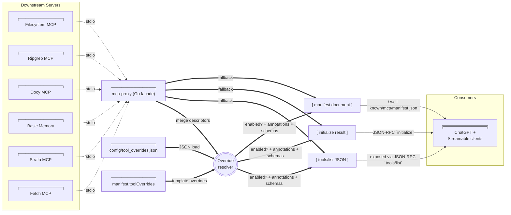
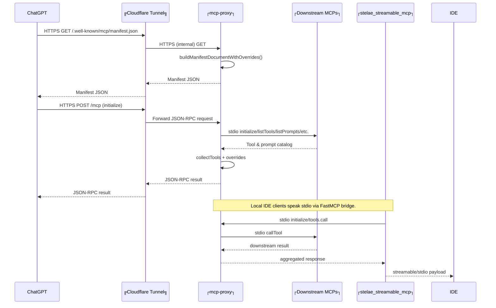

# Stelae MCP Architecture

## Overview

Stelae combines a Go-based MCP aggregation proxy, a fleet of downstream MCP servers, a FastMCP bridge for stdio clients, and a Cloudflare tunnel for public access. Everything originates from the local WSL workspace while remaining consumable by remote ChatGPT Connectors.

### Legend

```text
┌──────────────┐  System / long-lived process
╔══════════════╗  External service (Cloudflare, ChatGPT, etc.)
(  Rounded box )  Ephemeral request/response payload or intermediate document
-->             HTTP(S) / SSE request (labelled as needed)
-.->            stdio / local IPC (labelled "stdio")
==>             Internal data merge / transformation
```

## Catalog Aggregation & Overrides



* Downstream MCP servers register their tool descriptors during startup (`collectTools`).
* Overrides are merged in the following order:
  1. `manifest.toolOverrides` from `config/proxy.json`.
  2. `config/tool_overrides.json` (optional per-server and master blocks).
  3. Master (`*`) overrides apply last.
* Overrides can rewrite names, descriptions, annotations, and now full `inputSchema`/`outputSchema` blocks. We use this to advertise the shimmed Scrapling contract and any future fallback wrappers.
* The proxy filters out any tool/server marked `enabled: false` before producing `initialize`, `tools/list`, and manifest payloads.
* `scripts/scrapling_shim_mcp.py` records per-tool schema states in `config/tool_schema_status.json` and patches `config/tool_overrides.json` whenever it discovers a server that needs wrapping. After rerunning `make render-proxy` + restarting PM2, external clients see the updated schemas.
* Facade fallback descriptors (`search`, `fetch`) remain available even if no downstream server supplies them, and they can also be overridden via the master block.

## Request / Response Paths



* Remote clients traverse the Cloudflare tunnel; local clients use the FastMCP bridge (`scripts/stelae_streamable_mcp.py`).
* All paths share the same override-aware catalog inside the Go facade, guaranteeing consistent visibility between local and remote consumers.

## Component Topology

```mermaid
flowchart TD
    subgraph PM2
        A["┌──────────────┐<br>mcp-proxy"]
        B["┌──────────────┐<br>stelae_streamable_mcp"]
        C["┌──────────────┐<br>cloudflared"]
        D["┌──────────────┐<br>watchdog"]
    end

    subgraph MCP Servers
        FS[Filesystem]
        RG[Ripgrep]
        SH[Shell]
        DOCS[Docy]
        MEM[Memory]
        FETCH[Fetch]
        STRATA[Strata]
    end

    A ==▷|stdio| FS
    A ==▷|stdio| RG
    A ==▷|stdio| SH
    A ==▷|stdio| DOCS
    A ==▷|stdio| MEM
    A ==▷|stdio| FETCH
    A ==▷|stdio| STRATA

    B ==▷|stdio| A
    A --▶|HTTP/SSE :9090| C
    C --▶|HTTPS| Public(("╔ChatGPT / Clients╗"))

    D --▶|diagnostic probes| C
    D --▶|pm2 restart| C

    Config["┌──────────────┐<br>config/proxy.json"] --> A
    Overrides["┌──────────────┐<br>config/tool_overrides.json"] --> A
```

## Operational Notes

1. `make render-proxy` regenerates `config/proxy.json`, preserving the override file path.
2. `bash scripts/restart_stelae.sh --full` rebuilds the proxy, restarts PM2 processes, redeploys the Cloudflare worker, and republishes the manifest (ensuring overrides take effect everywhere).
3. To temporarily hide a tool or server from clients, set `"enabled": false` in `config/tool_overrides.json`, rerun `make render-proxy`, then execute the restart script.

This document should serve as the reference for future diagnostics or enhancements to the catalog pipeline and transport topology.
