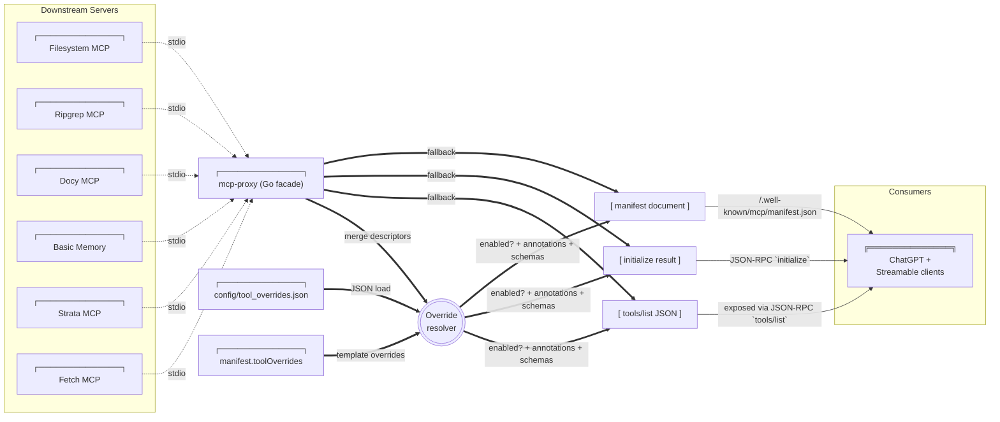
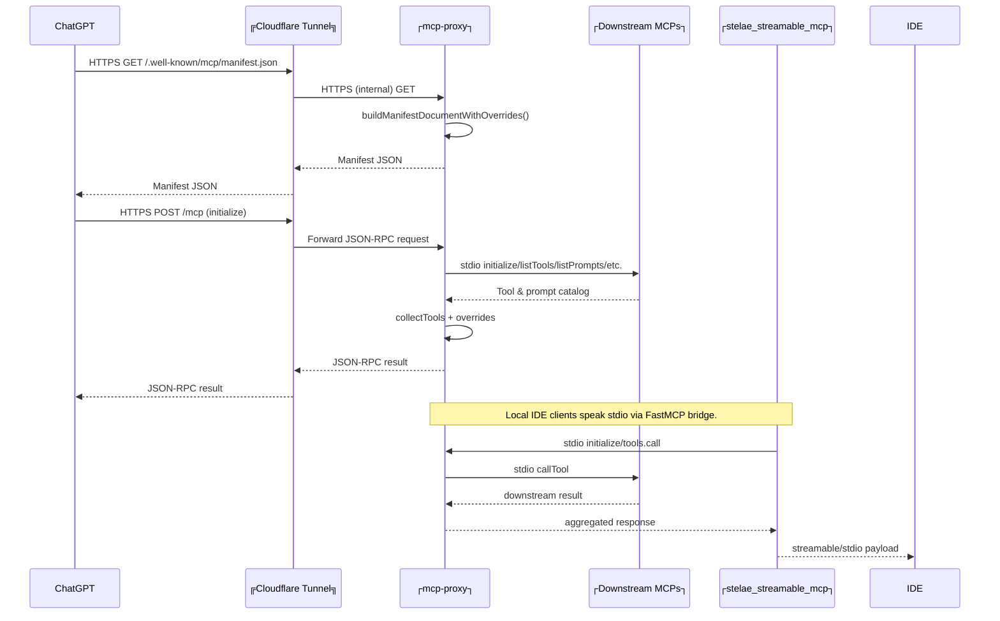

# Stelae MCP Architecture

## Overview

Stelae combines a Go-based MCP aggregation proxy, a fleet of downstream MCP servers, a FastMCP bridge for stdio clients, and a Cloudflare tunnel for public access. Everything originates from the local WSL workspace while remaining consumable by remote ChatGPT Connectors.

### Legend

```text
┌──────────────┐  System / long-lived process
╔══════════════╗  External service (Cloudflare, ChatGPT, etc.)
(  Rounded box )  Ephemeral request/response payload or intermediate document
-->             HTTP(S) / SSE request (labelled as needed)
-.->            stdio / local IPC (labelled "stdio")
==>             Internal data merge / transformation
```

## Catalog Aggregation & Overrides



* Downstream MCP servers register their tool descriptors during startup (`collectTools`).
* Overrides are merged in the following order:
  1. `manifest.toolOverrides` from `config/proxy.json`.
  2. `config/tool_overrides.json` (validated via `config/tool_overrides.schema.json`). Each tool override lives under its server while the `master.tools["*"]` wildcard provides shared defaults.
  3. Master (`*`) overrides apply last.
* Overrides can rewrite names, descriptions, annotations, and full `inputSchema`/`outputSchema` blocks. We use this to advertise the adapted contract the proxy enforces at call time.
* Scrapling’s `s_fetch_page` and `s_fetch_pattern` entries in `config/tool_overrides.json` are the canonical definition for their `{metadata, content}` outputs. The call-path adapter in the Go proxy writes back to the same file whenever it has to downgrade/upgrade a schema; rerun `make render-proxy` + the restart script after editing those overrides so manifests and streamable clients see the update immediately.
* The proxy filters out any tool/server marked `enabled: false` before producing `initialize`, `tools/list`, and manifest payloads.
* Every `tools/list` descriptor carries `"x-stelae": {"servers": [...], "primaryServer": "..."}` metadata. The restart script + populate helper rely on this to map schemas back to the correct server even after the proxy deduplicates tool names.
* The proxy records per-tool adapter state in `config/tool_schema_status.json` (path via `manifest.toolSchemaStatusPath`) and patches `config/tool_overrides.json` whenever call-path adaptation selects a different schema (e.g., persisting generic for text-only servers). After rerunning `make render-proxy` + restarting PM2, external clients see the updated schemas. `scripts/populate_tool_overrides.py --proxy-url <endpoint> --quiet` now runs during `scripts/restart_stelae.sh` so every restart reuses the freshly collected `tools/list` payload to ensure all downstream schemas are persisted; the script still supports per-server scans for development via `--servers`, and operators can opt out entirely for a given restart with `--skip-populate-overrides`. When invoking manually, export `PYTHONPATH=$STELAE_DIR` so the helper can import `stelae_lib`.
* Facade fallback descriptors (`search`, `fetch`) remain available even if no downstream server supplies them, and they can also be overridden via the master block.

## Request / Response Paths



* Remote clients traverse the Cloudflare tunnel; local clients use the FastMCP bridge (`scripts/stelae_streamable_mcp.py`).
* All paths share the same override-aware catalog inside the Go facade, guaranteeing consistent visibility between local and remote consumers.
* `manage_stelae` originates from the Go proxy manifest; the FastMCP bridge only injects a fallback descriptor (and short-circuits calls) if the proxy catalog is temporarily missing the tool. Once the proxy restarts cleanly, everything flows through the canonical manifest entry.

## Component Topology

```mermaid
flowchart TD
    subgraph PM2
        A["┌──────────────┐<br>mcp-proxy"]
        B["┌──────────────┐<br>stelae_streamable_mcp"]
        C["┌──────────────┐<br>cloudflared"]
        D["┌──────────────┐<br>watchdog"]
    end

    subgraph MCP Servers
        FS[Filesystem]
        RG[Ripgrep]
        SH[Shell]
        DOCS[Docy]
        MEM[Memory]
        FETCH[Fetch]
        STRATA[Strata]
        INT[Integrator]
    end

    A ==▷|stdio| FS
    A ==▷|stdio| RG
    A ==▷|stdio| SH
    A ==▷|stdio| DOCS
    A ==▷|stdio| MEM
    A ==▷|stdio| FETCH
    A ==▷|stdio| STRATA
    A ==▷|stdio| INT

    B ==▷|stdio| A
    A --▶|HTTP/SSE :9090| C
    C --▶|HTTPS| Public(("╔ChatGPT / Clients╗"))

    D --▶|diagnostic probes| C
    D --▶|pm2 restart| C

    Config["┌──────────────┐<br>config/proxy.json"] --> A
    Overrides["┌──────────────┐<br>config/tool_overrides.json"] --> A
```

## Discovery & Auto-Loading Pipeline

0. Run `python scripts/bootstrap_one_mcp.py` after cloning. The helper clones or updates the forked `~/apps/vendor/1mcpserver`, runs `uv sync`, ensures `config/discovered_servers.json` exists, and writes a ready-to-use `~/.config/1mcp/mcp.json`. This keeps upstream repos read-only and makes discovery reproducible for every contributor.
1. The 1mcp agent watches the workspace and writes normalized descriptors to `config/discovered_servers.json` (one array of `{name, transport, command|url, args, env, tools, options}` objects). The file is tracked in git so proposed additions can be reviewed. The `discover_servers` operation in `manage_stelae` can also populate this cache directly, taking `query` + optional `tags`, `preset`, `limit`, and `min_score` filters. The results array echoes the fully normalised descriptors so operators can install them without a follow-up `list_discovered_servers` call. CLI folks can run `make discover-servers` (wrapper around `scripts/discover_servers_cli.py`) to drive the same operation via env vars when MCP isn’t involved.
2. During discovery the integrator applies catalog overrides for known slugs (for example Qdrant) so metadata-only entries gain runnable transport/command/env fields immediately. When an override introduces new env keys, the tool appends safe defaults to the local `.env` (never `.env.example`) so fresh clones remain generic yet installs succeed without manual edits.
3. `scripts/stelae_integrator_server.py` exposes the `manage_stelae` tool (and CLI) which loads the discovery cache, validates descriptors, and transforms them through three focussed helpers. The MCP bridge advertises the tool locally so Codex/clients call `stelae.manage_stelae` directly instead of shelling out:
   - `DiscoveryStore` normalises transports (`stdio`, `http`, `streamable-http`), cleans args/env, and flags incomplete entries.
   - `ProxyTemplate` ensures `config/proxy.template.json` gains sorted server stanzas, raising unless `force` is set when a duplicate exists.
   - `ToolOverridesStore` pre-populates `config/tool_overrides.json` (master + per-server) with descriptions and tool metadata so manifests stay descriptive from the first render.
4. After writing files (or emitting diffs during dry-runs) the integrator re-runs `make render-proxy` and `scripts/run_restart_stelae.sh --keep-pm2 --no-bridge --full`, guaranteeing that Cloudflare + streamable clients receive the new catalog immediately while keeping the MCP bridge connected. The tool waits for the proxy’s JSON-RPC health probes to succeed before returning.
5. Operations available through `manage_stelae`/CLI: `discover_servers`, `list_discovered_servers`, `install_server`, `remove_server`, `refresh_discovery`, and `run_reconciler`. Every response shares a single envelope containing `status`, `details`, `files_updated`, `commands_run`, `warnings`, and `errors` for easier automation.
6. Guardrails: commands referenced in descriptors must resolve on disk or via `.env` placeholders (`{{KEY}}`). The tool fails fast if binaries/vars are missing, before any template changes occur, and refuses to overwrite `.env.example` to keep the repo clone-friendly.

## Operational Notes

1. `make render-proxy` regenerates `config/proxy.json`, preserving the override file path.
2. `bash scripts/run_restart_stelae.sh --full` rebuilds the proxy, restarts PM2 processes, redeploys the Cloudflare worker, and republishes the manifest (ensuring overrides take effect everywhere). The helper prints one-line `pm2 ensure <app>: status=<prev> -> <action>` entries so operators can see whether it started a missing process, deleted+started an unhealthy one, or simply refreshed an online entry.
3. `scripts/watch_public_mcp.py` shares the same `pm2 ensure` logic; when the public JSON-RPC probes fail it can now recreate `cloudflared` (delete+start) instead of looping on `pm2 restart`.
4. To temporarily hide a tool or server from clients, set `"enabled": false` in `config/tool_overrides.json`, rerun `make render-proxy`, then execute the restart script.

This document should serve as the reference for future diagnostics or enhancements to the catalog pipeline and transport topology.
