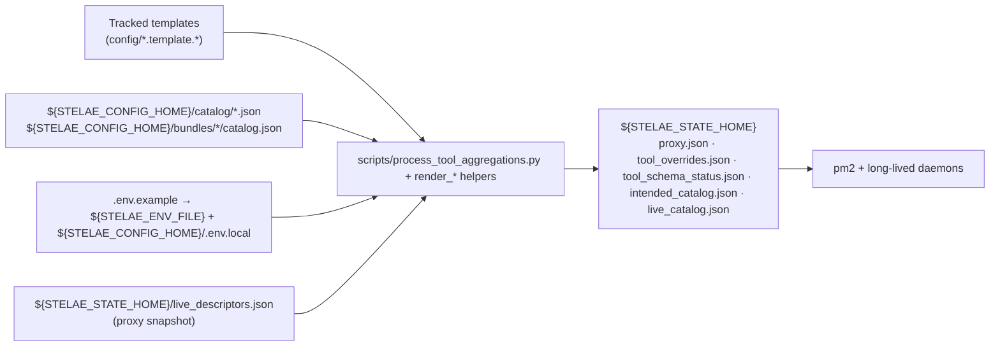
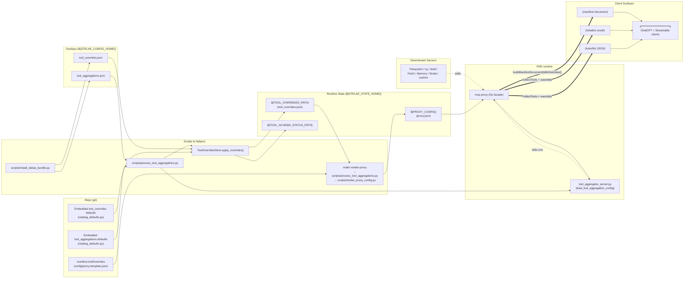
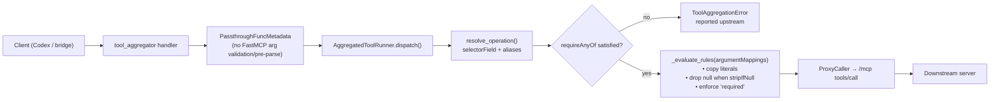
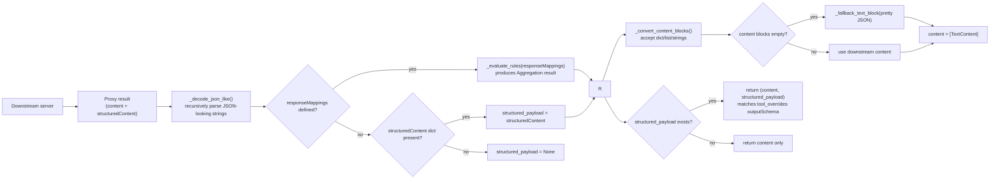
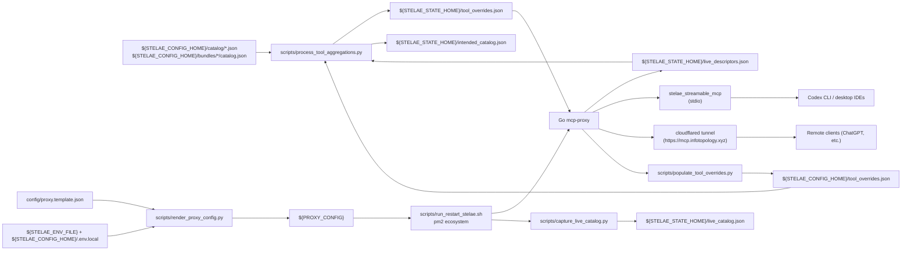
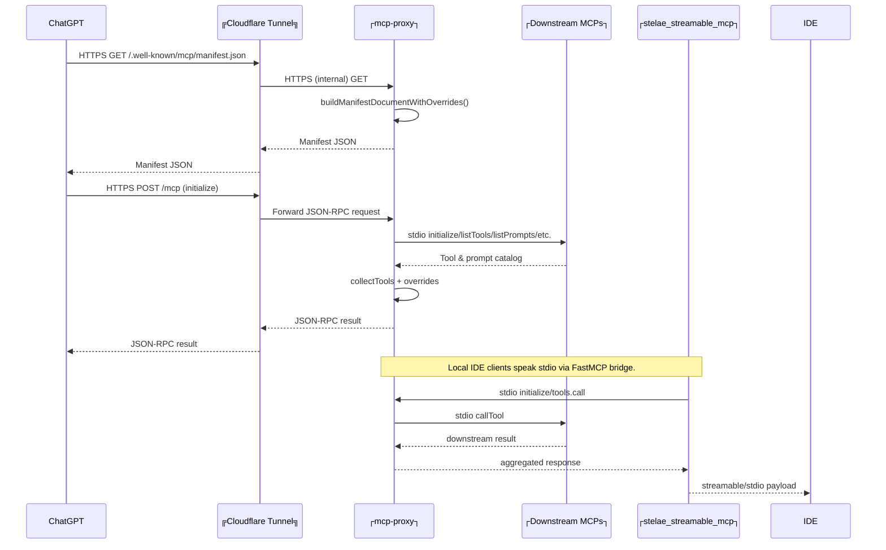

# Stelae MCP Architecture

## Overview

Stelae combines a Go-based MCP aggregation proxy, a fleet of downstream MCP servers, a FastMCP bridge for stdio clients, and a Cloudflare tunnel for public access. Everything originates from the local WSL workspace while remaining consumable by remote ChatGPT Connectors. The Go proxy currently comes from the [Dub1n/mcp-proxy](https://github.com/Dub1n/mcp-proxy) fork so we can expose a unified `/mcp` facade (HEAD/GET/POST) for readiness probes and streamable clients while upstreaming the feature.

### Config layout

Templates live under `config/` in this repo; machine-specific state lives in `${STELAE_CONFIG_HOME}` (default `~/.config/stelae`) and runtime artifacts land in `${STELAE_STATE_HOME}` (default `${STELAE_CONFIG_HOME}/.state`). Catalog fragments (`${STELAE_CONFIG_HOME}/catalog/*.json` seeded by `scripts/setup_env.py --materialize-defaults` plus `${STELAE_CONFIG_HOME}/bundles/*/catalog.json`) supply overrides/aggregations/hide entries for the tool aggregator. Writable helpers are split by ownership: `${STELAE_CONFIG_HOME}` holds human-edited overlays (`tool_overrides.json`, `custom_tools.json`) while `${STELAE_STATE_HOME}` owns runtime artifacts (`tool_overrides.json` mirror, `tool_schema_status.json`, `discovered_servers.json`, `intended_catalog.json`, `live_catalog.json`, `live_descriptors.json`, drift logs). Environment values obey the same layering: `.env.example` stays generic, `${STELAE_ENV_FILE}` (default `${STELAE_CONFIG_HOME}/.env`) is human-edited, and `${STELAE_CONFIG_HOME}/.env.local` (or the last env file provided to the integrator) receives hydrated defaults so git remains clean even when overrides introduce new variables.

All mutable lookups flow through `require_home_path`, which rejects paths outside `${STELAE_CONFIG_HOME}`/`${STELAE_STATE_HOME}`; fixtures and helpers assume those roots.

Hygiene guardrail: `pytest tests/test_repo_sanitized.py` fails if tracked templates reintroduce absolute `/home/...` paths or if `.env.example` stops pointing runtime outputs at `${STELAE_CONFIG_HOME}`. Keep the broader regression `PYTHONPATH=. .venv/bin/pytest --ignore tests/test_e2e_clone_smoke.py` green (expected skips only) after config/catalog changes. `make verify-clean` wraps the same render/restart automation (`scripts/run_restart_stelae.sh --keep-pm2 --no-bridge --no-cloudflared --skip-populate-overrides`) and fails immediately if tracked drift appears.

**Workflow:** after editing templates or catalog fragments run `python scripts/process_tool_aggregations.py --scope local`, then `make render-proxy`, then `pytest tests/test_repo_sanitized.py`; use `make verify-clean` before publishing manifest changes so restart automation proves `git status` remains empty. The consolidated workbook in `dev/tasks/stelae-smoke-readiness.md` references this loop whenever catalog or harness work begins.

#### Catalog → runtime render flow



Templates remain read-only; renderers merge them with config-home fragments, env layers, and the latest `${STELAE_STATE_HOME}/live_descriptors.json` snapshot before emitting runtime JSON into `${STELAE_STATE_HOME}` (the only path PM2 reads). `live_catalog.json` is captured after restarts so intended vs live drift stays auditable.

### Core vs optional bundle

- **Tracked core:** custom tools, the Stelae integrator, the tool aggregator helper, the 1mcp stdio agent, and the public 1mcp catalog bridge (plus the Go proxy and FastMCP bridge). These five servers ship in `config/proxy.template.json` so every clone can immediately discover and manage downstream MCP servers. Aggregated tools now live exclusively in `${STELAE_CONFIG_HOME}` via bundle installers so the tracked templates stay vendor-neutral.
- **Starter bundle:** Basic Memory, Strata, Fetch, Scrapling, Cloudflared/worker helpers, filesystem/ripgrep command runners, and any other discovery-fed servers now ship as the folder `bundles/starter/`. Installing it via `python scripts/install_stelae_bundle.py` copies the folder into `${STELAE_CONFIG_HOME}/bundles/starter/`, registers install refs, and lets the catalog loader merge its `catalog.json` fragment alongside `${STELAE_CONFIG_HOME}/catalog/*.json`. Use `--force` when you need the installer to overwrite an existing server entry instead of manually invoking `manage_stelae`. The Codex MCP wrapper intentionally lives outside this bundle to keep the default manifest lean—install it manually with `manage_stelae install_server` after you copy a wrapper release into `${STELAE_CONFIG_HOME}`.
- Optional modules keep their writable state (env files, catalog fragments, bundle folders, discovery caches) under `${STELAE_CONFIG_HOME}`. Remove a bundle folder to drop back to the slim core without mutating tracked templates.
- Aggregated tool schemas are normalized to `{"type": "object"}` when absent or overly permissive so MCP clients that reject schema type arrays (e.g., Codex MCP) keep the Stelae catalog loaded. If a client drops Stelae tools on `list_tools`, regenerate overrides (`python scripts/process_tool_aggregations.py --scope local`) and restart to propagate normalized descriptors.

### Legend

```text
┌──────────────┐  System / long-lived process
╔══════════════╗  External service (Cloudflare, ChatGPT, etc.)
(  Rounded box )  Ephemeral request/response payload or intermediate document
-->             HTTP(S) / SSE request (labelled as needed)
-.->            stdio / local IPC (labelled "stdio")
==>             Internal data merge / transformation
```

## Catalog Aggregation & Overrides

> Note: tracked mutable templates (`config/tool_overrides.json`, `config/tool_aggregations.json`, `config/custom_tools.json`, `config/discovered_servers.json`, `config/tool_schema_status.json`) have been removed. Aggregations now live solely inside catalog fragments under `${STELAE_CONFIG_HOME}/catalog/*.json` and `${STELAE_CONFIG_HOME}/bundles/*/catalog.json`; the only separate overlay file left in config-home is `tool_overrides.json`, with runtime mirrors/artifacts in `${STELAE_STATE_HOME}`.



- **Authoring & overlays:** config-home catalog fragments (`${STELAE_CONFIG_HOME}/catalog/core.json` seeded via `scripts/setup_env.py --materialize-defaults`, any additional `${STELAE_CONFIG_HOME}/catalog/*.json`, plus `${STELAE_CONFIG_HOME}/bundles/*/catalog.json`) define the baseline catalog. Embedded defaults live in `stelae_lib/catalog_defaults.py`, and tracked schemas under `config/*.schema.json` remain only for validation; runtime behavior is driven by the config-home fragments so optional suites never leak into git.
- **Aggregation + overrides pipeline:**
  - `scripts/process_tool_aggregations.py` merges every fragment (plus the embedded defaults from `stelae_lib/catalog_defaults.py`), validates the combined payload against `config/tool_aggregations.schema.json`, writes the transformed descriptors/`hiddenTools` entries via `ToolOverridesStore.apply_overrides()`, and emits `${STELAE_STATE_HOME}/intended_catalog.json` (timestamped with fragment metadata) for downstream tooling. The renderer now prefers `${STELAE_STATE_HOME}/live_descriptors.json`, fails fast if that snapshot is missing or stale unless `--allow-stale-descriptors` is passed, appends drift summaries to `${STELAE_STATE_HOME}/live_catalog_drift.log`, and updates `tool_schema_status.json` only when live descriptors are present; `--verify` also fails when the live catalog snapshot is missing unless drift is explicitly allowed. `--scope default` restricts the merge to `catalog/core.json` so you can safely refresh the tracked defaults; `--scope local` (default) processes the full catalog.
  - `ToolOverridesStore` layers the embedded defaults with config-home overrides, then writes the resolved catalog to `${STELAE_STATE_HOME}/tool_overrides.json` (`${TOOL_OVERRIDES_PATH}`) plus schema metadata to `${TOOL_SCHEMA_STATUS_PATH}`. This step runs inside `make render-proxy` and also whenever `manage_stelae` installs/removes servers.
  - `scripts/render_proxy_config.py` embeds the resolved override path into `${STELAE_STATE_HOME}/proxy.json`, so pm2 and the restart helper always launch the proxy with the correct runtime file.
- **Runtime surfaces & responsibilities:**
  - `mcp-proxy` loads `${PROXY_CONFIG}`, launches every downstream server (including `tool_aggregator_server.py`), and calls `collectTools` to gather descriptors. Aggregate tools register themselves from the merged aggregation config; base servers (filesystem, ripgrep, shell, fetch, etc.) register via their native clients.
  - `buildManifestDocumentWithOverrides()` evaluates the same override set the JSON-RPC pipeline uses, so `/mcp/manifest.json`, the `initialize` response, and `tools/list` all share one resolver while still honouring transport-specific annotations.
  - Any server or tool marked `enabled:false` in the embedded defaults or config-home fragments is suppressed before descriptors reach clients. The proxy also annotates every exposed descriptor with `x-stelae` metadata that captures the primary and fallback servers, which is how troubleshooters map Codex observations back to the originating process.
- **Live catalog capture:** Immediately after `scripts/restart_stelae.sh` verifies that the proxy is handling `tools/list`, it launches `python scripts/capture_live_catalog.py` to persist the raw JSON-RPC payload (plus metadata such as timestamp, proxy base, and tool count) to `${STELAE_STATE_HOME}/live_catalog.json`. This snapshot is the authoritative “what the proxy actually advertised” record operators diff against `${STELAE_STATE_HOME}/intended_catalog.json`; renderer `--verify` fails if the live snapshot is missing (unless drift is explicitly allowed), and drift deltas are appended to `${STELAE_STATE_HOME}/live_catalog_drift.log`. The restart flow also emits a best-effort diff via `scripts/diff_catalog_snapshots.py` (with `--fail-on-drift`) so missing/extra tool names are visible immediately after capture, runs `scripts/catalog_metrics.py` to emit a JSON metrics snapshot under `${STELAE_STATE_HOME}`, and prunes timestamped history via `scripts/prune_catalog_history.py` to respect env limits. Capture fresh snapshots manually with `python scripts/capture_live_catalog.py --proxy-base http://127.0.0.1:9090 [--output /tmp/live.json]` whenever you need to debug catalog drift without performing a full restart.
- **Where to debug catalog drift:** when a tool disappears, check (in order) the catalog fragments under `${STELAE_CONFIG_HOME}`, the generated runtime files in `${STELAE_STATE_HOME}` (`tool_overrides.json`, `intended_catalog.json`, schema caches), and the aggregator’s runtime config. `scripts/run_e2e_clone_smoke_test.py --capture-debug-tools` snapshots each of these surfaces so we can compare the manifest/initialize/tools-list payloads Codex saw against the expected catalog.

## Operations & Troubleshooting

### Troubleshooting quick reference

| Symptom | Likely cause | How to fix |
| --- | --- | --- |
| `mcp-proxy` not listening on `:${PROXY_PORT}` | Go build failed or pm2 stopped | `./scripts/run_restart_stelae.sh` or `source ~/.nvm/nvm.sh && pm2 restart mcp-proxy` |
| Override hints missing from manifest | runtime overrides not loaded or stale | confirm `${TOOL_OVERRIDES_PATH}` is valid JSON, rerun `make render-proxy`, then `scripts/run_restart_stelae.sh --full` |
| `tools/call search` returns `{ "results": [] }` | running an old version; static hits missing | rebuild Go proxy (`facade_search.go`) and restart |
| Codex CLI reports “MCP client … request timed out” | STDIO bridge launched without proper env | ensure the Codex config exports `PYTHONPATH=/home/gabri/dev/stelae` and `STELAE_STREAMABLE_TRANSPORT=stdio`; run `make check-connector` locally |
| Cloudflare 530 splash | tunnel momentarily unhealthy | rerun `scripts/run_restart_stelae.sh --full` (validates tunnel + pm2), or `source ~/.nvm/nvm.sh && pm2 restart cloudflared` |
| `make check-connector` flags unexpected catalog | new upstream tools exposed or overrides missing | inspect `logs/mcp-proxy.err.log`, confirm `${TOOL_OVERRIDES_PATH}` is current, rerun restart |
| Startup logs mention "master override" warnings | master-level description/title overrides present | keep only the wildcard `"*"` entry under `master.tools`; move other overrides under their server |
| `tools/call fetch` returns network errors | upstream site blocked / fetch server delay | retry or inspect `logs/fetch.err.log` |
| SSE drops quickly | Cloudflare idle timeout | ensure Go proxy heartbeat loop is running (keepalives every 15s) |

### Reference commands

```bash
# PM2 management
source ~/.nvm/nvm.sh
pm2 status
pm2 logs mcp-proxy --lines 150
pm2 restart cloudflared

# Re-run public probe & archive log
CONNECTOR_BASE=https://mcp.infotopology.xyz/mcp make check-connector

# Manual STDIO smoke test (inside WSL)
python - <<'PY'
import os, anyio
from mcp.client.stdio import stdio_client, StdioServerParameters
from mcp.client.session import ClientSession

params = StdioServerParameters(
    command='/home/gabri/.venvs/stelae-bridge/bin/python',
    args=['-m', 'scripts.stelae_streamable_mcp'],
    env={
        'PYTHONPATH': '/home/gabri/dev/stelae',
        'STELAE_PROXY_BASE': f'http://127.0.0.1:{os.environ.get("PROXY_PORT", "9090")}',
        'STELAE_STREAMABLE_TRANSPORT': 'stdio',
        'PATH': os.environ['PATH'],
    },
    cwd='/home/gabri/dev/stelae',
)

async def main():
    async with stdio_client(params) as (read, write):
        async with ClientSession(read, write) as session:
            init = await session.initialize()
            print(init.serverInfo)
            tools = await session.list_tools()
            print([t.name for t in tools.tools])

anyio.run(main)
PY
```

### Clone smoke harness

- `scripts/run_e2e_clone_smoke_test.py` now provisions a throwaway workspace, installs the full starter bundle, seeds a Codex-friendly "client" repo, mirrors `~/.codex` into an isolated `CODEX_HOME`, drives `codex exec --json` through bundle/install/remove stages, and deletes any previously kept smoke sandboxes (`stelae-smoke-workspace-*` + `.stelae_smoke_workspace`) before creating a new one (unless `--reuse-workspace` is set). The script parses the JSONL transcripts and fails if required MCP calls (`workspace_fs_read`, `grep`, `manage_stelae`) are missing.
- Automatic runs cover the entire regression suite (`pytest tests/test_repo_sanitized.py` early, then the full suite + `make verify-clean` after Codex) and assert `git status` is clean after every managed install/remove. Use `--codex-cli`, `--codex-home`, `--workspace`, or `--wrapper-release` to tweak the sandbox inputs. Raw transcripts live under `${WORKSPACE}/codex-transcripts` for auditing.
- Pass `--manual` to drop back to the human-in-the-loop flow (the harness emits `manual_playbook.md` + `manual_result.json` and exits so a tester can run the mission in `dev/tasks/missions/e2e_clone_smoke.json`). Use `--manual-stage bundle-tools|install|remove` for stage-specific pause/resume, `--reuse-workspace` when resuming an existing sandbox, and `--cleanup-only [--workspace /path]` to retroactively delete kept workspaces without provisioning a new sandbox.
- **Testing rule of thumb:** keep the entire pytest/make suite clone-friendly. Any test that only works in the primary dev workspace must be clearly marked (e.g., pytest marker, separate make target) with rationale, and should never block the clone-focused harness. Default assumption: fresh clones run every regression test without modification.

### Tool aggregation helper

**Why:** Operators wanted a way to expose curated, high-level tools without duplicating logic across MCP servers or manually editing the overrides template. The aggregation helper keeps the catalog clean by letting us describe composites in JSON, hide the noisy downstream entries, and reuse the existing proxy infrastructure for dispatch.

**How it works:**

1. Catalog fragments under `${STELAE_CONFIG_HOME}/catalog/*.json` plus `${STELAE_CONFIG_HOME}/bundles/*/catalog.json` define aggregations, defaults, and hide rules. The payload is validated against `config/tool_aggregations.schema.json`, with embedded defaults sourced from `stelae_lib/catalog_defaults.py`.
2. `scripts/process_tool_aggregations.py` runs during `make render-proxy` and the restart workflow. The default `--scope local` merges every fragment (plus embedded defaults), writes the transformed descriptors/`hiddenTools` entries via `ToolOverridesStore.apply_overrides()`, and emits `${STELAE_STATE_HOME}/intended_catalog.json` for downstream tooling. `--scope default` restricts the merge to `catalog/core.json` so you can safely refresh the embedded defaults without picking up local bundles.
3. `scripts/tool_aggregator_server.py` is a FastMCP stdio server launched by the proxy. On startup it registers one MCP tool per aggregation; at call time it validates the input per the declarative mapping rules, translates arguments into the downstream schema, and uses the proxy JSON-RPC endpoint to call the real tool. A custom `FuncMetadata` shim bypasses FastMCP’s argument marshalling so payloads are forwarded exactly as Codex sends them, and the runner now unwraps JSON-in-a-string responses before returning the downstream `content` blocks plus their original `structuredContent`. Response mappings (optional) can still reshape the downstream payload before returning to the client.
4. Because both the overrides and the stdio helper derive from the same config, adding a new aggregate requires zero Python changes—edit the JSON, run `make render-proxy`, and the proxy automatically restarts the helper with the new catalog.

Tracked suites declared in the embedded defaults:

- (Reserved) Documentation catalog aggregate – will be reintroduced once the vendor-neutral tooling lands.

After you install the starter bundle, the synced `${STELAE_CONFIG_HOME}/bundles/starter/catalog.json` contributes the optional suites (`workspace_fs_read`, `workspace_fs_write`, `workspace_shell_control`, `memory_suite`, `scrapling_fetch_suite`, and `strata_ops_suite`) so third-party helpers continue to surface as a single aggregate entry without touching tracked templates.

If `tools/list` ever shrinks to the fallback `fetch`/`search` entries, the aggregator likely failed to register; rerun `make restart-proxy` (or `scripts/run_restart_stelae.sh --full`) to relaunch the stdio server and restore the curated catalog.

#### Aggregated Tool Formatting Flow

The request/response wiring below shows every component that touches the payload, along with the conditions that affect formatting. When we bypass FastMCP’s schema conversion we only skip redundant JSON parsing—the declarative argument and response mapping layers still enforce the schemas mirrored in `tool_overrides.json`.





Key takeaways:

- **Input path:** clients can send unparsed JSON strings (typical of some MCP agents). `PassthroughFuncMetadata` forwards them untouched, while the declarative `argumentMappings` still enforce required arguments and strip `null` values so downstream calls remain deterministic.
- **Output path:** every downstream response flows through `_decode_json_like` and `_convert_content_blocks`, guaranteeing that `structuredContent` remains a genuine object while the text block mirrors the payload. When `responseMappings` exist (e.g., to wrap results inside `{"result": {...}}`), the transformed dict is what the client receives; otherwise we reuse the downstream schema verbatim.
- **Tool overrides:** `ToolAggregationConfig.apply_overrides()` still updates `tool_overrides.json` with the aggregate’s `inputSchema`/`outputSchema`, so Codex sees descriptors that match the runtime behavior (tuple return when `structured_payload` exists, plain text when it does not).

- The proxy records per-tool adapter state in `${TOOL_SCHEMA_STATUS_PATH}` (path set through `manifest.toolSchemaStatusPath`) and patches `${TOOL_OVERRIDES_PATH}` whenever call-path adaptation selects a different schema (e.g., persisting generic for text-only servers). After rerunning `make render-proxy` + restarting PM2, external clients see the updated schemas. `scripts/populate_tool_overrides.py --proxy-url <endpoint> --quiet` now runs during `scripts/restart_stelae.sh` so every restart reuses the freshly collected `tools/list` payload to ensure all downstream schemas are persisted; the script still supports per-server scans for development via `--servers`, and operators can opt out entirely for a given restart with `--skip-populate-overrides`. When invoking manually, export `PYTHONPATH=$STELAE_DIR` so the helper can import `stelae_lib`.
- Facade fallback descriptors (`search`, `fetch`) remain available even if no downstream server supplies them, and they can also be overridden via the master block.

### Catalog publication & Codex trust boundaries

**Renderer → pm2 → proxy.** The catalog always originates from the rendered proxy config: `config/proxy.template.json:2-76` defines the Go facade address plus `toolOverridesPath`/`toolSchemaStatusPath` fields that point at `${STELAE_STATE_HOME}`. `scripts/render_proxy_config.py:18-78` loads layered `.env` values, guarantees `PROXY_PORT` is set (defaulting to `PUBLIC_PORT` or `9090`), and writes the merged JSON to `${PROXY_CONFIG}` (defaulting to `~/.config/stelae/.state/proxy.json`). Restarts (`scripts/run_restart_stelae.sh:41-139`) export that same `PROXY_PORT`, honor `STELAE_USE_INTENDED_CATALOG` (default `1` from `.env.example`), wait for the HTTP `/mcp` endpoint to report a minimum tool count, and immediately run `scripts/populate_tool_overrides.py` through the proxy so schema changes are captured in the config-home overrides. Use `--intended-catalog` / `--legacy-catalog` (or `--catalog-mode=intended|legacy`) to toggle the flag for a single restart; the helper logs whichever input path was loaded so drift triage has a permanent breadcrumb. The clone-smoke harness keeps disposable sandboxes from clashing with the long-lived dev proxy by writing the randomly chosen `choose_proxy_port()` value into `.env`, `${STELAE_CONFIG_HOME}`, and the rendered proxy file inside `${STELAE_STATE_HOME}` (`stelae_lib/smoke_harness.py:54-122` plus docs/e2e_clone_smoke_test.md:89-124), and its new `--catalog-mode` option runs legacy + intended restarts back-to-back when needed. Because `ecosystem.config.js:24-65` always launches pm2 with `${PROXY_CONFIG}`, exports `${STELAE_CONFIG_HOME}`/`${STELAE_STATE_HOME}`, and defaults `STELAE_USE_INTENDED_CATALOG` to `1`, any sandbox or developer environment that needs a different port or catalog mode must ensure both env vars are updated before restarts run.

#### Catalog rendering & publication flow



Tracked + local overrides (plus the proxy-generated `live_descriptors.json`) feed `process_tool_aggregations.py`, renderers materialize `${PROXY_CONFIG}`, the restart helper launches pm2 processes, and both FastMCP and Cloudflare consumers read the exact catalog that `/mcp` advertises. `capture_live_catalog.py` persists the live `tools/list` payload for drift checks, and `populate_tool_overrides.py` completes the loop by snapshotting live schemas back into the overlay.

**Bridge + Codex trust.** The FastMCP bridge (`scripts/stelae_streamable_mcp.py:61-519`) acts as the stdio endpoint for Codex/VS Code. On startup it loads `.env`/`.env.local` (via `load_layered_env`) so downstream helpers inherit the same `STELAE_*` paths as pm2, queries `PROXY_BASE` for `tools/list`, injects a local fallback descriptor for `manage_stelae` if the proxy catalog still lacks it, and monkey-patches FastMCP to forward `tools/list`, `tools/call`, prompts, and resources straight through to the Go facade. Codex only trusts the catalog it receives during `initialize`; even if `/mcp` and the TUI report the expected entries, an interactive session will continue using whatever tool list it cached earlier. That is why verifying the catalog requires creating a fresh Codex session each time the proxy restarts, rather than relying on `codex mcp` or curl probes alone.

**Verification loop.** Going forward we will treat the Codex MCP Wrapper automation as the “orchestrator” and `codex exec --json` sessions as disposable “testers.” The orchestrator (invoked through the `codex-wrapper-dev.batch` MCP tool) applies repo changes, renders configs, or restarts the stack; after every change it spawns a fresh Codex agent via `codex exec` so the tester can confirm the newly trusted catalog contains `stelae.manage_stelae`, `workspace_fs_read`, and the other must-have tools without out-of-band hints. Harness transcripts (`docs/e2e_clone_smoke_test.md:105-124`) already parse the bundle/install/remove stages, and this loop extends that coverage to catalog publication itself: if the tester ever falls back to CLI commands or reports “tool not found,” we know the proxy failed to advertise the entries during `initialize` and can bisect the issue immediately. The wrapper remains a separate MCP server (opt-in via `manage_stelae install_server`) so these trials never contaminate the default Stelae manifest.

## Request / Response Paths



- Remote clients traverse the Cloudflare tunnel; local clients use the FastMCP bridge (`scripts/stelae_streamable_mcp.py`).
- All paths share the same override-aware catalog inside the Go facade, guaranteeing consistent visibility between local and remote consumers.
- `manage_stelae` originates from the Go proxy manifest; the FastMCP bridge only injects a fallback descriptor (and short-circuits calls) if the proxy catalog is temporarily missing the tool. Once the proxy restarts cleanly, everything flows through the canonical manifest entry.

## Component Topology

```mermaid
flowchart TD
    subgraph PM2
        A["┌──────────────┐<br>mcp-proxy"]
        B["┌──────────────┐<br>stelae_streamable_mcp"]
        C["┌──────────────┐<br>cloudflared"]
        D["┌──────────────┐<br>watchdog"]
    end

    subgraph MCP Servers
        FS[Filesystem]
        RG[Ripgrep]
        SH[Shell]
        MEM[Memory]
        FETCH[Fetch]
        STRATA[Strata]
        INT[Integrator]
    end

    A ==▷|stdio| FS
    A ==▷|stdio| RG
    A ==▷|stdio| SH
    A ==▷|stdio| MEM
    A ==▷|stdio| FETCH
    A ==▷|stdio| STRATA
    A ==▷|stdio| INT

    B ==▷|stdio| A
    A --▶|HTTP/SSE :${PROXY_PORT}| C
    C --▶|HTTPS| Public(("╔ChatGPT / Clients╗"))

    D --▶|diagnostic probes| C
    D --▶|pm2 restart| C

    Config["┌──────────────┐<br>${PROXY_CONFIG}"] --> A
    Overrides["┌──────────────┐<br>${TOOL_OVERRIDES_PATH}"] --> A
```

Filesystem/ripgrep/shell/memory/fetch/strata nodes arrive via the starter bundle (`${STELAE_CONFIG_HOME}/bundles/starter`); the tracked proxy template only includes the core set (custom tools, integrator, tool aggregator helper, 1mcp stdio agent, public catalog bridge, Go proxy/bridge).

## Discovery & Auto-Loading Pipeline

0. Run `python scripts/bootstrap_one_mcp.py` after cloning. The helper clones or updates the forked `~/apps/vendor/1mcpserver`, runs `uv sync`, ensures `${STELAE_STATE_HOME}/discovered_servers.json` exists (initially empty), and writes a ready-to-use `~/.config/1mcp/mcp.json`. This keeps upstream repos read-only and makes discovery reproducible for every contributor without polluting git.
1. The 1mcp agent watches the workspace and writes normalized descriptors to `${STELAE_STATE_HOME}/discovered_servers.json` (one array of `{name, transport, command|url, args, env, tools, options}` objects). Fresh clones intentionally start with an empty cache; operators run `manage_stelae discover_servers` (or `make discover-servers`, a wrapper around `scripts/discover_servers_cli.py`) to seed it with results relevant to their environment. The file is treated as runtime state, so deleting it simply resets discovery output.
2. During discovery the integrator applies catalog overrides for known slugs (for example Qdrant) so metadata-only entries gain runnable transport/command/env fields immediately. When an override introduces new env keys, the tool appends safe defaults to the writable env overlay (defaults to `${STELAE_CONFIG_HOME}/.env.local`, or the final `env_files` entry provided) so `${STELAE_ENV_FILE}`/`.env.example` stay generic yet installs succeed without manual edits.
3. `scripts/stelae_integrator_server.py` exposes the `manage_stelae` tool (and CLI) which loads the discovery cache, validates descriptors, and transforms them through three focussed helpers. The MCP bridge advertises the tool locally so Codex/clients call `stelae.manage_stelae` directly instead of shelling out:
   - `DiscoveryStore` normalises transports (`stdio`, `http`, `streamable-http`), cleans args/env, and flags incomplete entries.
   - `ProxyTemplate` ensures `config/proxy.template.json` gains sorted server stanzas, raising unless `force` is set when a duplicate exists.
   - `ToolOverridesStore` pre-populates `${STELAE_CONFIG_HOME}/tool_overrides.json` (and therefore `${TOOL_OVERRIDES_PATH}`) with descriptions and tool metadata so manifests stay descriptive from the first render.
4. After writing files (or emitting diffs during dry-runs) the integrator re-runs `make render-proxy` and `scripts/run_restart_stelae.sh --keep-pm2 --no-bridge --no-cloudflared`, guaranteeing local parity (proxy + stdio bridge) even when operators lack Cloudflare credentials. Set `STELAE_RESTART_ARGS` to override those flags (for example `--full` to redeploy the tunnel + manifest). The tool waits for the proxy’s JSON-RPC health probes to succeed before returning.
5. Operations available through `manage_stelae`/CLI: `discover_servers`, `list_discovered_servers`, `install_server`, `remove_server`, `refresh_discovery`, and `run_reconciler`. Every response shares a single envelope containing `status`, `details`, `files_updated`, `commands_run`, `warnings`, and `errors` for easier automation.
6. Guardrails: commands referenced in descriptors must resolve on disk or via `.env` placeholders (`{{KEY}}`). The tool fails fast if binaries/vars are missing, before any template changes occur, and refuses to overwrite `.env.example` to keep the repo clone-friendly.

## Operational Notes

1. `make render-proxy` regenerates `${PROXY_CONFIG}` (defaults to `${STELAE_CONFIG_HOME}/proxy.json`), preserving the override file path. The pm2 ecosystem file (`ecosystem.config.js`) now uses the same default, so even long-lived daemons pick up the rendered overlay unless you explicitly set `PROXY_CONFIG` to a different path.
2. `bash scripts/run_restart_stelae.sh --keep-pm2 --no-bridge --no-cloudflared` rebuilds the proxy, restarts PM2 processes, and validates the local JSON-RPC flow—this is the default path invoked by `manage_stelae`, keeping contributor laptops functional without requiring a tunnel. Append `--full` when you explicitly need to redeploy Cloudflare (manifest push + tunnel restart). The helper prints one-line `pm2 ensure <app>: status=<prev> -> <action>` entries so operators can see whether it started a missing process, deleted+started an unhealthy one, or simply refreshed an online entry.
3. `scripts/watch_public_mcp.py` shares the same `pm2 ensure` logic; when the public JSON-RPC probes fail it can now recreate `cloudflared` (delete+start) instead of looping on `pm2 restart`.
4. To temporarily hide a tool or server from clients, set `"enabled": false` via `${STELAE_CONFIG_HOME}/tool_overrides.json`, rerun `make render-proxy`, then execute the restart script.
5. Built-in servers (`one_mcp`, `facade`) can be hidden via the env vars `STELAE_ONE_MCP_VISIBLE` / `STELAE_FACADE_VISIBLE`; the renderer keeps the servers running but marks them disabled in the intended catalog so they stay hidden from tools/list while remaining available for internal use.

This document should serve as the reference for future diagnostics or enhancements to the catalog pipeline and transport topology.
