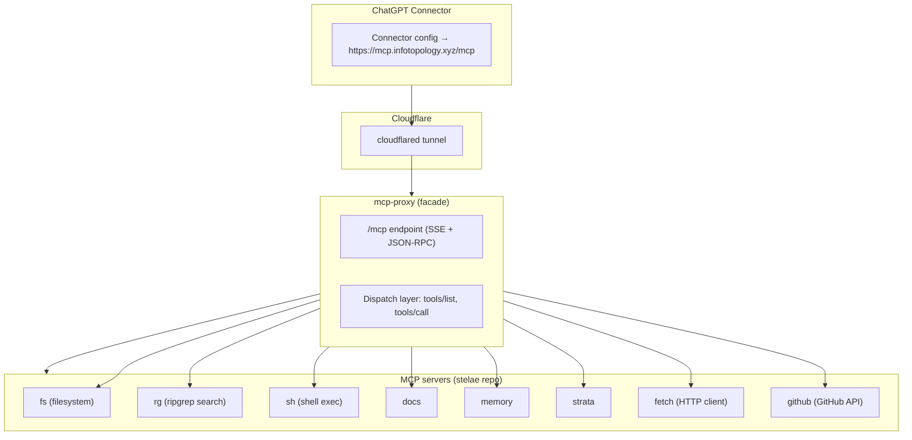

# stelae: architecture spec

## plain english overview

this whole setup is a stitched-together backend so that ChatGPT’s “MCP connectors” can talk to a bunch of different local tools and services, but instead of juggling a dozen endpoints, they only need to hit one clean URL:
`https://mcp.infotopology.xyz/mcp`.

**how it flows:**

* your *local MCP servers* (filesystem, grep, shell, docs, memory, strata, fetch, etc.) are each little processes, each exposing a JSON-RPC/SSE interface. they’re individually fine, but raw they’d all be separate URLs.
* the **mcp-proxy** sits in front as a **facade router**. it starts all those MCP servers, keeps them alive under pm2, and exposes a unified `/mcp` endpoint. when a client (like ChatGPT) connects, it doesn’t need to know about the underlying tools — the proxy handles `initialize`, `tools/list`, and `tools/call` by dispatching to the right MCP server.
* **cloudflared** tunnels that single port (9090 locally) to the outside world, pinned on a static domain with TLS and Cloudflare’s keepalive. that’s why ChatGPT can connect with one URL and not freak out about redirects or timeouts.
* **memory** is just one MCP server among many; not the master. it provides its own `/mem/mcp` endpoint, but from the outside it’s merged into the same tool list as everything else. the proxy makes sure that `/mcp` is always the right entrypoint, regardless of which tool you call.
* result: a fully ChatGPT-compliant MCP endpoint, with `HEAD`/`GET`/`POST` all behaving as the Connector spec requires, and all your essential tools callable through one path.

in effect, you’ve built a **multi-tenant MCP gateway**: local agents plugged in behind one façade, wrapped by pm2 for persistence and cloudflared for reachability. it’s modular enough that you can add/remove tools without breaking the client contract.

## system layout



### stelae repo

* holds configs (`config/proxy.json`), pm2 ecosystem, and the local MCP servers.
* each tool (fs, rg, sh, etc.) is either a Rust stdio MCP or a Python one, managed under pm2.
* config keys in `proxy.json` tell the proxy where each server lives (`/fs`, `/rg`, etc.).

### mcp-proxy repo (modified)

* added **dispatch logic**: `/mcp` POSTs are unwrapped and sent to the correct child server’s `/jsonrpc` endpoint.
* patched `http.go` to:

  * normalize `mcpPath` so `/mcp` works regardless of baseURL.
  * make `/mcp` always return valid SSE heartbeats on GET.
  * handle `initialize` and `tools/list` by aggregating tool manifests from all live servers.
  * forward `tools/call` to the right MCP server, stripping auth requirements internally.
* added **guardrails** so JSON parsing errors or empty body don’t crash the proxy.

### process supervision

* pm2 manages everything. typical process list:

  * `mcp-proxy` (facade)
  * `cloudflared` (tunnel to `mcp.infotopology.xyz`)
  * `fs`, `rg`, `sh`, `docs`, `mem`, `strata`, `fetch`, `github` (local MCP servers)
* pm2 startup is bound to systemd with `pm2 startup systemd -u gabri --hp /home/gabri` + `pm2 save`.

### external exposure

* cloudflared connects local port `9090` to Cloudflare’s infra, giving you TLS + static domain.
* remote clients (ChatGPT) never see your LAN, only `https://mcp.infotopology.xyz/mcp`.

---

## quick checks

**local health**:

```bash
# see if proxy is listening
ss -ltnp | grep :9090

# confirm proxy is alive
curl -sI http://127.0.0.1:9090/mcp | head -5
```

**remote health**:

```bash
# SSE check
curl -iN https://mcp.infotopology.xyz/mcp -H 'Accept: text/event-stream' | head -5

# initialize
curl -s https://mcp.infotopology.xyz/mcp \
  -H 'Content-Type: application/json' \
  --data '{"jsonrpc":"2.0","id":"1","method":"initialize","params":{"protocolVersion":"2024-11-05"}}' | jq .

# tools list
curl -s https://mcp.infotopology.xyz/mcp \
  -H 'Content-Type: application/json' \
  --data '{"jsonrpc":"2.0","id":"2","method":"tools/list"}' | jq -r '.result.tools[].name' | sort | head -20
```

**tool smoke test**:

```bash
# fetch
curl -s https://mcp.infotopology.xyz/mcp \
  -H 'Content-Type: application/json' \
  --data '{"jsonrpc":"2.0","id":"3","method":"tools/call","params":{"name":"fetch","arguments":{"url":"https://example.com","raw":true}}}' | jq .
```

---

## maintenance guidance

* **restart everything**

  ```bash
  pm2 restart all
  pm2 save
  ```

* **logs**

  ```bash
  pm2 logs mcp-proxy --lines 100
  pm2 logs cloudflared --lines 100
  ```

* **check tool registration**
  if a tool is missing from `tools/list`, check the corresponding server’s pm2 logs for init errors.

* **cloudflared tunnel**
  if the remote endpoint 502s, restart cloudflared:

  ```bash
  pm2 restart cloudflared
  ```

* **updating proxy code**
  rebuild binary, replace in `~/apps/mcp-proxy`, then:

  ```bash
  pm2 restart mcp-proxy
  ```

## failure modes -> quick fixes

> purpose: when something smells off, glance here first. each row = symptom → likely cause → what to do.

| symptom (what you see)                                                            | likely cause                                                                  | fix (fast path)                                                                                                                               |                                                                                    |
| --------------------------------------------------------------------------------- | ----------------------------------------------------------------------------- | --------------------------------------------------------------------------------------------------------------------------------------------- | ---------------------------------------------------------------------------------- |
| `curl -iN https://…/mcp` stalls or 301/302                                        | wrong route or proxy not listening                                            | `ss -ltnp                                                                                                                                     | grep :9090`; ensure`mcp-proxy`is online. expect **200** on`HEAD /mcp`, never 3xx. |
| Cloudflare shows `502` / tunnel logs “connect: connection refused 127.0.0.1:9090” | proxy down or restarting                                                      | `pm2 restart mcp-proxy`; if still failing: `pm2 logs mcp-proxy --lines 100`.                                                                  |                                                                                    |
| `POST /mcp initialize` returns HTTP 404 or plain text                             | you’re hitting the wrong port/route (old bridge), or proxy binary not updated | `curl -i http://127.0.0.1:9090/mcp` should be **200**. If not, rebuild `mcp-proxy` and `pm2 restart mcp-proxy`.                               |                                                                                    |
| `{"error":{"code":-32602,"message":"Missing sessionId"}}`                         | some legacy handlers checking for sessionId                                   | current facade handles `initialize` locally; ensure you rebuilt and restarted.                                                                |                                                                                    |
| `tools/list` returns empty array                                                  | servers didn’t register tools yet / slow init window                          | try once more (facade already waits ~2s). If still empty: `pm2 logs mcp-proxy` and each server, look for “Failed to add client to server: …”. |                                                                                    |
| a tool is missing (e.g., `grep`, `filesystem`)                                    | that MCP process isn’t online or failed handshake                             | `pm2 status`; then `pm2 logs <name>`. Confirm it logs “Handling requests at /<name>/”.                                                        |                                                                                    |
| `tools/call` → `{"error":{"code":-32601,"message":"Unknown tool: …"}}`            | tool name mismatch                                                            | `tools/list` to get the exact name; call that.                                                                                                |                                                                                    |
| `X-Proxy-Internal-Path` header shows `/amap/send` or weird subpaths               | old adaptive path list tried wrong candidates                                 | you’re on the fixed facade now. if you still see this, rebuild; the current proxy tries `/<server>/mcp`, then `/<server>/`.                   |                                                                                    |
| direct `POST /fetch/` returns `401 Unauthorized`                                  | per-server auth is enabled (expected!)                                        | via `/mcp` it works; the facade sets `X-Proxy-Internal: 1` to bypass per-server auth. Don’t call per-server routes directly.                  |                                                                                    |
| `tools/call(fetch)` returns “Failed to fetch robots.txt …” with `isError: true`   | upstream site blocked robots or transient network blip                        | re-run, or use `raw:true` (already did). If the schema had `respectRobots`, set false; else ignore—it’s informational.                        |                                                                                    |
| `/mcp` GET returns 200 text/plain “page not found”                                | you’re hitting an old binary                                                  | confirm build time; redeploy the updated `mcp-proxy`.                                                                                         |                                                                                    |
| public manifest is missing or wrong                                               | old config                                                                    | `curl -s https://mcp.infotopology.xyz/.well-known/mcp/manifest.json`; if stale, restart proxy.                                                |                                                                                    |
| `pm2 startup` complained about spaces / “env: ‘Files’: No such file or directory” | shell quoting during sudo invocation                                          | use the quoted command we used (with `--hp "/home/gabri"`); after, `pm2 save`.                                                                |                                                                                    |
| SSE drops after ~100s over Cloudflare                                             | heartbeats missing or proxy buffered                                          | facade sends keepalives; ensure you’re on the latest build; Cloudflare is fine with ≤20s heartbeats (we comply).                              |                                                                                    |

**core sanity loop (run these in order):**

```bash
# 1) local port up
ss -ltnp | grep :9090

# 2) SSE (local)
curl -iN http://127.0.0.1:9090/mcp -H 'Accept: text/event-stream' | head -5

# 3) initialize (public)
curl -s https://mcp.infotopology.xyz/mcp \
  -H 'Content-Type: application/json' \
  --data '{"jsonrpc":"2.0","id":"1","method":"initialize","params":{"protocolVersion":"2024-11-05"}}' | jq .

# 4) tool catalog (public)
curl -s https://mcp.infotopology.xyz/mcp \
  -H 'Content-Type: application/json' \
  --data '{"jsonrpc":"2.0","id":"2","method":"tools/list"}' | jq -r '.result.tools[].name' | sort | sed -n '1,40p'

# 5) a tool call (public)
curl -i https://mcp.infotopology.xyz/mcp \
  -H 'Content-Type: application/json' \
  --data '{"jsonrpc":"2.0","id":"3","method":"tools/call","params":{"name":"fetch","arguments":{"url":"https://example.com","raw":true}}}' \
| sed -n '1,40p'
```
